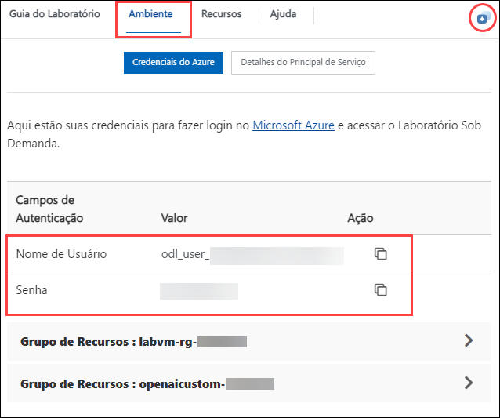

# Introdução ao Laboratório

1. Depois do ambiente ser provisionado, uma máquina virtual (JumpVM) e o guia do laboratório será carregado no seu navegador. Use essa máquina virtual em todo o laboratório para o executar.  Na área inferior do guia do laboratório pode-se ver o número de exercícios e alternar para diferentes exercícios do guia do laboratório.

   .png "Lab Environment")

1. Para obter os detalhes do ambiente de laboratório pode selecionar o separador **Ambiente**. Além disso, as credenciais também foram enviadas por e-mail para o endereço de e-mail fornecido durante o registro. Também poderá abrir o Guia do laboratório numa janela separada selecionando **Janela dividida** no canto inferior direito. Por fim, pode iniciar, parar e reiniciar máquinas virtuais no separador **Recursos**.

   
 
    > No separador **Ambiente** pode ver o valor SUFFIX. Use-o sempre que vir SUFFIX ou Deployment ID nos passos do laboratório.

## Login no portal de Azure

1. Na JumpVM, clique no atalho do portal do Azure na área de trabalho.

   .png "Lab Environment")

1. Na página Welcome to Microsoft Edge, selecione **Comece sem seus dados**, e na página de ajuda para importar dados de navegação do Google, selecione o botão **Continuar sem esses dados** e prossiga para selecionar **Confirme e comece a navegar** na próxima página. 

1. No separador **Entrar no Microsoft Azure** verá um ecrã de início de sessão, introduza o seguinte email/username e, em seguida clique em **Avancar**.

   * Email/Username: <inject key="AzureAdUserEmail"></inject>
   
     .png "Lab Environment")
     
1. Agora introduza a seguinte palavra-passe e clique em **Entrar**.

   * Password: <inject key="AzureAdUserPassword"></inject>
   
     .png "Lab Environment")
     
1. Se vir o pop-up **Permanecer conectado?**, clique em **Não**.

   .png "Lab Environment")

1. Se vir o pop-up **Você tem recomendações gratuitas do Azure Advisor!**, feche a janela para continuar o laboratório.

1. Se uma janela pop-up **Bem-vindo ao Microsoft Azure** for exibida, clique em **Cancelar** para ignorar o passeio.
   
1. De seguida pode ver o Azure Portal Dashboard, clique em **Grupos de recursos** no painel Navigate para ver os resource groups.

   .png "Lab Environment")

1. Confirme que tem resource groups presentes, conforme o screenshot abaixo. Os últimos seis dígitos no nome do resource groups são exclusivos para cada utilizador   

   .png "Lab Environment")
   
1. Clique em "Próximo" no canto inferior direito para começar sua jornada no laboratório!

## Contato de Suporte

A equipe de suporte da CloudLabs está disponível 24/7, 365 dias por ano, via e-mail e chat para garantir assistência contínua a qualquer momento. Oferecemos canais de suporte dedicados especificamente para alunos e instrutores, garantindo que todas as suas necessidades sejam prontamente e eficientemente atendidas.

Contatos de Suporte para Alunos:

- Suporte por E-mail: cloudlabs-support@spektrasystems.com
- Suporte por Chat ao Vivo: https://cloudlabs.ai/labs-support

Agora, clique em Próximo no canto inferior direito para passar para a próxima página.

## Votos de bom treinamento!
