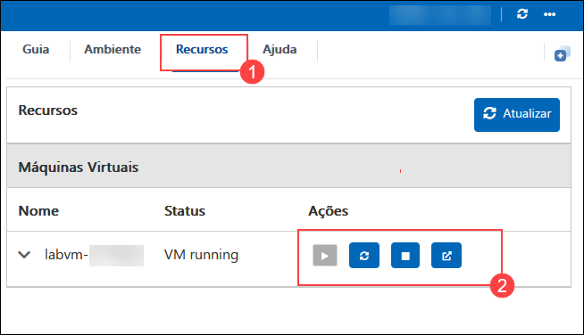

# Use o Azure Open AI como um profissional para criar aplicativos de IA poderosos

### Duração estimada: 8 Horas

## Visão geral

Estes laboratórios práticos oferecem treinamento abrangente sobre a integração dos recursos do OpenAI em diversos aplicativos e ambientes. Eles abrangem a construção de pipelines no Azure Synapse para processamento de dados em lote e operações inteligentes, a criação de aplicativos com Power Apps e Python que utilizam as APIs do OpenAI para tarefas como processamento de linguagem natural e análise de dados, e a exploração de tópicos avançados, como engenharia de prompts e ajuste fino de modelos usando o Azure OpenAI Studio. As seções somente leitura oferecem insights teóricos sobre conceitos avançados, técnicas de ajuste fino, hiperparâmetros no Serviço Azure OpenAI e um glossário para a compreensão dos principais termos e conceitos. Juntos, esses laboratórios visam equipar os participantes com as habilidades práticas e o conhecimento teórico necessários para utilizar efetivamente as tecnologias OpenAI em diferentes plataformas e aplicativos.

## Objetivo

Este laboratório foi desenvolvido para equipar os participantes com experiência prática no uso do Azure OpenAI para criar aplicativos de IA avançados. Ao concluir este laboratório, os participantes aprenderão a:

1. **Construir um Pipeline Open AI para Ingerir Dados em Lote, Executar Operações Inteligentes e Analisar no Synapse:** Desenvolver um pipeline para integrar o OpenAI para ingestão de dados em lote, operações inteligentes e análise no Azure Synapse. Os participantes criarão um pipeline robusto para processar e analisar dados em lote com os recursos do OpenAI integrados ao Azure Synapse.

1. **Construir um aplicativo Open AI com o Power App:** Criar um aplicativo usando o Power Apps que integre os recursos do OpenAI para tarefas como compreensão de linguagem natural ou processamento de dados. Os participantes desenvolverão um aplicativo de negócios funcional usando os recursos do OpenAI no Microsoft Power Apps, aprimorando a interação e a automação do usuário.

1. **Construir um aplicativo Open AI com Python:** Criar aplicativos usando Python para aproveitar as APIs do OpenAI para tarefas como geração de linguagem, análise de sentimentos ou sistemas de recomendação. Os participantes construirão uma aplicação personalizada utilizando APIs Python e OpenAI para geração e análise avançadas de texto.

1. **Introdução à Engenharia de Prompts e ao Azure OpenAI Studio:** Aprenda técnicas para criar prompts eficazes e utilize o Azure OpenAI Studio para desenvolver e implantar modelos de IA. Os participantes aprenderão como otimizar as respostas de modelos de IA por meio de engenharia de prompts eficaz e utilizarão o Azure OpenAI Studio para o desenvolvimento de modelos.

## Explorar

Explore e entenda os exercícios somente leitura para obter conhecimento adicional sobre os conceitos do Azure OpenAI:

1. **Conceitos Avançados (Somente Leitura):** Explore conhecimento teórico avançado e aplicações práticas relacionadas às tecnologias OpenAI e suas implementações. Os participantes obterão insights teóricos sobre conceitos avançados de IA, enriquecendo sua compreensão das tecnologias de IA.

1. **Ajuste Fino (Somente Leitura):** Entenda e pratique o ajuste fino de modelos OpenAI para melhorar o desempenho em tarefas ou conjuntos de dados específicos. Os participantes entenderão os princípios e técnicas de ajuste fino de modelos de IA para melhorar o desempenho em tarefas específicas.

1. **Visão Geral Básica dos Hiperparâmetros do Serviço Azure OpenAI (Somente Leitura):** Obtenha uma compreensão fundamental dos hiperparâmetros no Serviço Azure OpenAI e seu impacto no treinamento e desempenho do modelo. Os participantes adquirirão conhecimento sobre hiperparâmetros no Serviço Azure OpenAI, cruciais para a configuração e otimização do modelo.

1. **Glossário (somente leitura):** Acesse definições e explicações de termos e conceitos essenciais para a compreensão do OpenAI e do Azure OpenAI Service. Os participantes se familiarizarão com as principais terminologias de IA e do Azure, aprimorando sua compreensão de conceitos e tecnologias relacionados.

## Pré-requisitos

Os participantes devem ter:

- Proficiência na linguagem de programação Python, incluindo bibliotecas como Pandas para manipulação de dados e Flask para desenvolvimento de aplicações web.
- Experiência com Microsoft Power Apps ou plataformas low-code similares para desenvolvimento de aplicações e integração de APIs.
- Conhecimento básico de conceitos de machine learning, como treinamento de modelos, fluxos de trabalho de implantação e APIs RESTful.
- Conhecimento de conceitos de IA, como processamento de linguagem natural, ajuste fino de modelos e otimização de hiperparâmetros.

## Arquitetura

Estes laboratórios utilizam o Azure Synapse para integração de dados e pipelines de análise, o Power Apps para desenvolvimento intuitivo de aplicações OpenAI, o Python para soluções orientadas por IA usando APIs OpenAI e o Azure OpenAI Studio para desenvolvimento de modelos com engenharia rápida. Os módulos somente leitura abrangem conceitos avançados de IA, ajuste fino, hiperparâmetros e um glossário, fornecendo conhecimento básico. Os participantes adquirem habilidades práticas para utilizar o OpenAI de forma eficaz em diversas aplicações em ambientes Azure.

## Diagrama de Arquitetura

## Explicação dos Componentes

A arquitetura deste laboratório envolve vários componentes principais:

- **Conta de Armazenamento:** Fornece uma solução de armazenamento em nuvem segura e escalável para armazenar objetos de dados, como arquivos, blobs e dados não estruturados.
- **Synapse Workspace:** O Azure Synapse Analytics é um serviço de análise integrado que combina recursos de big data e data warehouse. O workspace permite a colaboração perfeita entre engenheiros de dados, cientistas de dados e analistas.
- **Azure Open AI Service:** Fornece acesso aos poderosos modelos de IA do OpenAI por meio do Azure, permitindo a integração com aplicativos para processamento de linguagem natural, geração de texto e muito mais.
- **Microsoft Power Apps:** Uma plataforma de baixo código que permite aos usuários criar aplicativos de negócios personalizados sem amplo conhecimento de codificação.
- **Engenharia de Prompts:** Envolve a criação de prompts ou consultas específicas para obter as respostas desejadas dos modelos de IA, influenciando a saída e o comportamento dos sistemas de IA.

## Começando com o laboratório

Bem-vindo ao Workshop "Use o Azure Open AI como um profissional para criar aplicativos de IA poderosos"! Preparamos um ambiente perfeito para você explorar e aprender sobre os serviços do Azure. Vamos começar aproveitando ao máximo essa experiência:

## Acessando seu ambiente de laboratório

Quando estiver pronto para começar, sua máquina virtual e o guia de laboratório estarão ao seu alcance no seu navegador.

   

### Máquina Virtual e Guia de Laboratório

Sua máquina virtual é sua força motriz durante todo o workshop. O guia de laboratório é o seu roteiro para o sucesso.

## Explorando os Recursos do Seu Laboratório

Para entender melhor os recursos e credenciais do seu laboratório, navegue até a aba **Ambiente**.

   

## Utilizando o Recurso de Janela Dividida

Para sua conveniência, você pode abrir o guia do laboratório em uma janela separada selecionando o botão **Janela Dividida** no canto superior direito.

   

## Gerenciando sua Máquina Virtual

Sinta-se à vontade para **iniciar, parar** ou **reiniciar** sua máquina virtual conforme necessário na aba **Recursos**. Sua experiência está em suas mãos!

   

## Guia de Laboratório Ampliar/Reduzir

Para ajustar o nível de zoom da página do ambiente, clique no ícone **A↕ : 100%** localizado ao lado do cronômetro no ambiente do laboratório.

   

## Efetue login no Portal do Azure

1. Na JumpVM, clique no atalho do **Azure Portal** na área de trabalho.

   

1. Na aba **Entrar no Microsoft Azure**, você verá uma tela de login. Insira o seguinte e-mail/nome de usuário e clique em **Avançar**.

   * Email/Username: <inject key="AzureAdUserEmail"></inject>
   
     
     
1. Agora digite a seguinte senha e clique em **Entrar**.

   * Password: <inject key="AzureAdUserPassword"></inject>
   
     
     
1. Se você vir a janela pop-up **Permanecer conectado?**, clique em **Não**

   

1. Se uma janela pop-up **Bem-vindo ao Microsoft Azure** aparecer, clique em **Cancelar** para pular o tour.

    
   
1. Agora você verá o Painel do Portal do Azure. Clique em **Grupos de recursos** no painel Navegar para ver os grupos de recursos.

   .png "Lab Environment")

1. Confirme se você possui grupos de recursos presentes, conforme mostrado na captura de tela abaixo. Os últimos seis dígitos do nome do grupo de recursos são exclusivos para cada usuário.  

   
   
Este laboratório prático tem como objetivo capacitar os participantes a aproveitar as tecnologias OpenAI em ambientes do Azure, abrangendo ingestão de dados, desenvolvimento de aplicativos, engenharia de prompt, otimização de modelos e conceitos teóricos de IA para aprendizado e aplicação abrangentes.

## Contato de Suporte

A equipe de suporte da CloudLabs está disponível 24 horas por dia, 7 dias por semana, 365 dias por ano, por e-mail e chat ao vivo, para garantir assistência contínua a qualquer momento. Oferecemos canais de suporte dedicados, adaptados especificamente para alunos e instrutores, garantindo que todas as suas necessidades sejam atendidas com rapidez e eficiência.

Contatos de Suporte ao Aluno:
- Suporte por e-mail: cloudlabs-support@spektrasystems.com
- Suporte por chat ao vivo: https://cloudlabs.ai/labs-support

Agora, clique em **Próximo** no canto inferior direito para passar para a próxima página.

 

### Feliz aprendizado!!
