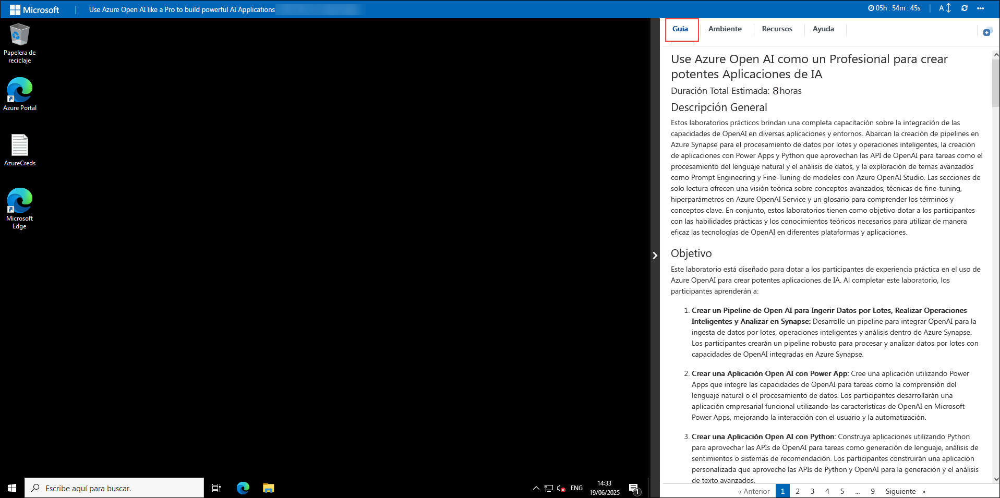
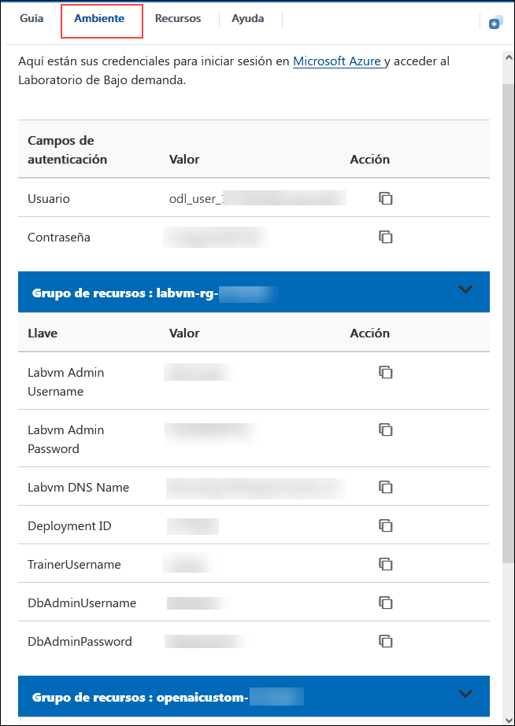
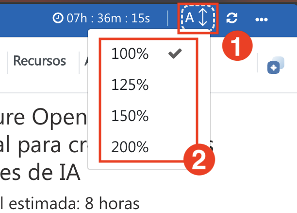
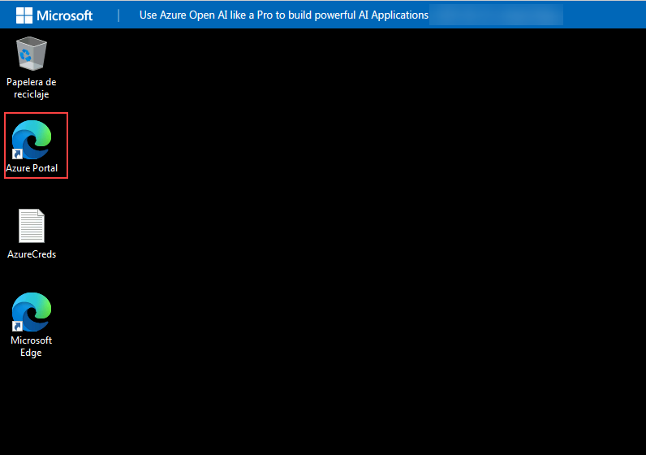
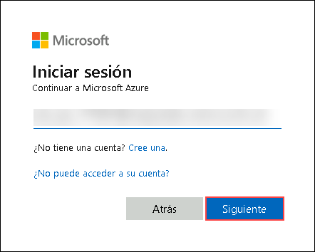
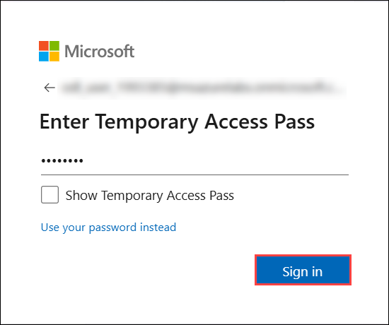
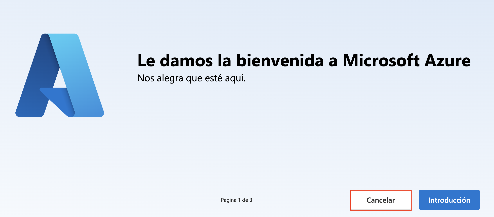
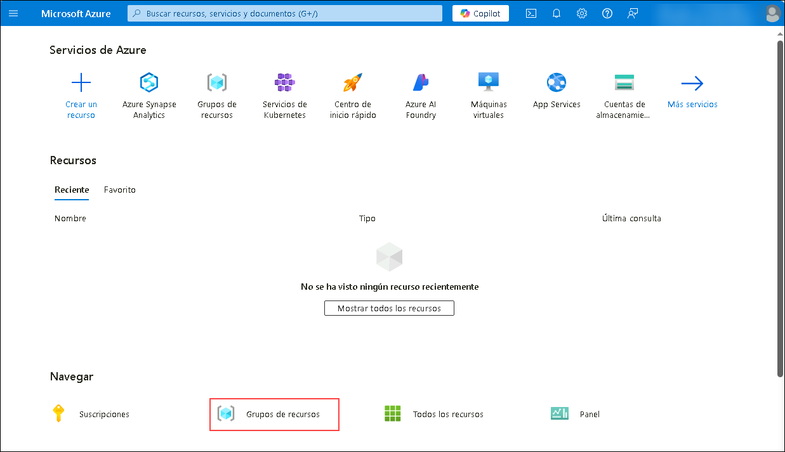

# Utilice Azure Open AI como un profesional para crear potentes aplicaciones de IA

### Duración total estimada: 8 horas

## Descripción General

Estos laboratorios prácticos brindan una completa capacitación sobre la integración de las capacidades de OpenAI en diversas aplicaciones y entornos. Abarcan la creación de pipelines en Azure Synapse para el procesamiento de datos por lotes y operaciones inteligentes, la creación de aplicaciones con Power Apps y Python que aprovechan las API de OpenAI para tareas como el procesamiento del lenguaje natural y el análisis de datos, y la exploración de temas avanzados como Prompt Engineering y Fine-Tuning de modelos con Azure OpenAI Studio. Las secciones de solo lectura ofrecen una visión teórica sobre conceptos avanzados, técnicas de fine-tuning, hiperparámetros en Azure OpenAI Service y un glosario para comprender los términos y conceptos clave. En conjunto, estos laboratorios tienen como objetivo dotar a los participantes con las habilidades prácticas y los conocimientos teóricos necesarios para utilizar de manera eficaz las tecnologías de OpenAI en diferentes plataformas y aplicaciones.

## Objetivo

Este laboratorio está diseñado para dotar a los participantes de experiencia práctica en el uso de Azure OpenAI para crear potentes aplicaciones de IA. Al completar este laboratorio, los participantes aprenderán a:

1. **Crear un Pipeline de Open AI para Ingerir Datos por Lotes, Realizar Operaciones Inteligentes y Analizar en Synapse:** Desarrolle un pipeline para integrar OpenAI para la ingesta de datos por lotes, operaciones inteligentes y análisis dentro de Azure Synapse. Los participantes crearán un pipeline robusto para procesar y analizar datos por lotes con capacidades de OpenAI integradas en Azure Synapse.
   
1. **Crear una Aplicación Open AI con Power App:** Cree una aplicación utilizando Power Apps que integre las capacidades de OpenAI para tareas como la comprensión del lenguaje natural o el procesamiento de datos. Los participantes desarrollarán una aplicación empresarial funcional utilizando las características de OpenAI en Microsoft Power Apps, mejorando la interacción con el usuario y la automatización.
   
1. **Crear una Aplicación Open AI con Python:** Construya aplicaciones utilizando Python para aprovechar las APIs de OpenAI para tareas como generación de lenguaje, análisis de sentimientos o sistemas de recomendación. Los participantes construirán una aplicación personalizada que aproveche las APIs de Python y OpenAI para la generación y el análisis de texto avanzados.

1. **Introducción a Prompt Engineering y Azure OpenAI Studio:** Aprenda técnicas para crear prompts efectivos y utilice Azure OpenAI Studio para desarrollar e implementar modelos de IA. Los participantes aprenderán a optimizar las respuestas de los modelos de IA a través de una Ingeniería de Prompts efectiva y a utilizar Azure OpenAI Studio para el desarrollo de modelos.

### Explore

Explore y comprenda los ejercicios de solo lectura para obtener conocimientos adicionales sobre los conceptos de Azure OpenAI:

1. **Conceptos Avanzados (Solo lectura):** Explore los conocimientos teóricos avanzados y las aplicaciones prácticas relacionadas con las tecnologías OpenAI y sus implementaciones. Los participantes obtendrán conocimientos teóricos sobre conceptos avanzados de IA, enriqueciendo su comprensión de las tecnologías de IA.

1. **Fine Tuning (Solo lectura):** Comprenda y practique el ajuste fino de los modelos OpenAI para mejorar el rendimiento en tareas o conjuntos de datos específicos. Los participantes comprenderán los principios y las técnicas de ajuste fino de los modelos de IA para mejorar el rendimiento en tareas específicas.

1. **Descripción Básica de los Hiperparámetros de Azure OpenAI Service (Solo lectura):** Obtenga una comprensión fundamental de los hiperparámetros en Azure OpenAI Service y su impacto en el entrenamiento y el rendimiento del modelo. Los participantes adquirirán conocimientos sobre los hiperparámetros en Azure OpenAI Service, cruciales para la configuración y optimización del modelo.

1. **Glosario (Solo lectura):** Acceda a definiciones y explicaciones de términos y conceptos clave esenciales para entender OpenAI y Azure OpenAI Service. Los participantes se familiarizarán con las terminologías clave de IA y Azure, mejorando su comprensión de los conceptos y tecnologías relacionadas.

## Requisitos previos

Los participantes deberían tener:

- Dominio del lenguaje de programación Python, incluyendo bibliotecas como Pandas para la manipulación de datos y Flask para el desarrollo de aplicaciones web.
- Experiencia con Microsoft Power Apps o plataformas de código bajo similares para el desarrollo de aplicaciones y la integración de APIs.
- Comprensión básica de conceptos de machine learning, tales como entrenamiento de modelos, flujos de trabajo de implementación y RESTful APIs.
- Comprensión de conceptos de IA, como el procesamiento de lenguaje natural, el ajuste fino de modelos y la optimización de hiperparámetros.

## Arquitectura

Estos laboratorios utilizan Azure Synapse para la integración de datos y los canales de análisis, Power Apps para el desarrollo intuitivo de aplicaciones OpenAI, Python para soluciones impulsadas por IA mediante APIs de OpenAI y Azure OpenAI Studio para el desarrollo de modelos con Prompt Engineering. Los módulos de solo lectura cubren conceptos avanzados de IA, fine-tuning, hiperparámetros y un glosario, proporcionando conocimientos básicos. Los participantes adquieren habilidades prácticas para aprovechar OpenAI eficazmente en diversas aplicaciones dentro de entornos de Azure.

## Diagrama de Arquitectura

## Explicación de Componentes

La arquitectura para este laboratorio involucra varios componentes clave:

- **Cuenta de almacenamiento:** Proporciona una solución de almacenamiento en la nube segura y escalable para almacenar objetos de datos, como archivos, blobs y datos no estructurados.
- **Espacio de trabajo de Synapse:** Azure Synapse Analytics es un servicio de análisis integrado que combina capacidades de big data y data warehousing. El espacio de trabajo permite una colaboración fluida entre ingenieros de datos, científicos de datos y analistas.
- **Servicio de Azure OpenAI:** Proporciona acceso a los potentes modelos de IA de OpenAI a través de Azure, lo que permite la integración en aplicaciones para el procesamiento del lenguaje natural, la generación de texto y más.
- **Microsoft Power Apps:** Una plataforma de código bajo que permite a los usuarios crear aplicaciones empresariales personalizadas sin amplios conocimientos de programación.
- **Prompt Engineering:** Implica la elaboración de prompts o consultas específicas para obtener las respuestas deseadas de los modelos de IA, influyendo en el resultado y el comportamiento de los sistemas de IA.

## Introducción al laboratorio

¡Bienvenido a su taller "¡Usa Azure Open AI como un profesional para crear potentes aplicaciones de IA!". Hemos preparado un entorno perfecto para que explore y aprenda sobre los servicios de Azure. Empecemos por aprovechar al máximo esta experiencia:

## Accediendo a su entorno de laboratorio

Una vez que esté listo para comenzar, su máquina virtual y la guía de laboratorio estarán a su disposición en su navegador web.

   

### Máquina Virtual y Guía de Laboratorio

Su máquina virtual es su herramienta principal durante el taller. La guía de laboratorio es su hoja de ruta hacia el éxito.

## Explorando los recursos de su laboratorio

Para comprender mejor los recursos y credenciales de su laboratorio, diríjase a la pestaña **Ambiente**.

   

## Uso de la función de ventana dividida

Para mayor comodidad, puede abrir la guía de laboratorio en una ventana separada seleccionando el botón **Ventana dividida** en la esquina superior derecha.

   

## Administre su máquina virtual

Puede **iniciar, detener o reiniciar (2)** su máquina virtual según sea necesario desde la pestaña **Recursos (1)**. ¡Su experiencia está en sus manos!

  

## Guía de laboratorio: Acercar/Alejar

Para ajustar el nivel de zoom de la página del entorno, haga clic en el icono **A↕ : 100%**, ubicado junto al temporizador en el entorno de laboratorio.

   

## Comience en el Portal de Azure

1. En LabVM, haga clic en el acceso directo **Azure Portal** del navegador Microsoft Edge que se encuentra en el escritorio.

   
   
1. En la pestaña **Iniciar sesión en Microsoft Azure** verá la pantalla de inicio de sesión. Ingrese el siguiente correo electrónico/nombre de usuario y luego haga clic en **Siguiente**.
   * Correo electrónico/Nombre de usuario: <inject key="AzureAdUserEmail"></inject>
   
     
     
1. Ahora ingrese la siguiente contraseña y haga clic en **Iniciar sesión**.
   * Contraseña: <inject key="AzureAdUserPassword"></inject>
   
     
     
1. Si ve la ventana emergente **¿Quiere mantener la sesión iniciada?**, haga clic en **No**

   

1. Si aparece una ventana emergente **Bienvenido a Microsoft Azure**, haga clic en **Cancelar** para omitir la visita guiada.

   

1. Ahora verá el Panel del portal de Azure; haga clic en **Grupos de recursos** en el panel Navegar para ver los grupos de recursos.

    
   
1. Confirme que tiene grupos de recursos presentes como se muestra en la siguiente captura de pantalla. Los últimos seis dígitos del nombre del grupo de recursos son únicos para cada usuario.

    
   
Este laboratorio práctico tiene como objetivo capacitar a los participantes en el aprovechamiento de las tecnologías OpenAI dentro de los entornos de Azure, que abarca la ingesta de datos, el desarrollo de aplicaciones, prompt engineering, la optimización de modelos y los conceptos teóricos de IA para un aprendizaje y una aplicación integrales.

## Contacto de Soporte
 
El equipo de soporte de CloudLabs está disponible las 24 horas del día, los 7 días de la semana, los 365 días del año, por correo electrónico y chat en vivo para garantizar una asistencia sin inconvenientes en cualquier momento. Ofrecemos canales de soporte dedicados, diseñados específicamente tanto para estudiantes como para instructores, garantizando que todas sus necesidades sean atendidas de forma rápida y eficiente.

Contactos de Soporte para Estudiantes:
- Soporte por Correo Electrónico: cloudlabs-support@spektrasystems.com
- Soporte por Chat En Vivo: https://cloudlabs.ai/labs-support

Ahora, haga clic en **Siguiente** en la esquina inferior derecha para pasar a la página siguiente.

   

### ¡¡Feliz Aprendizaje!!
