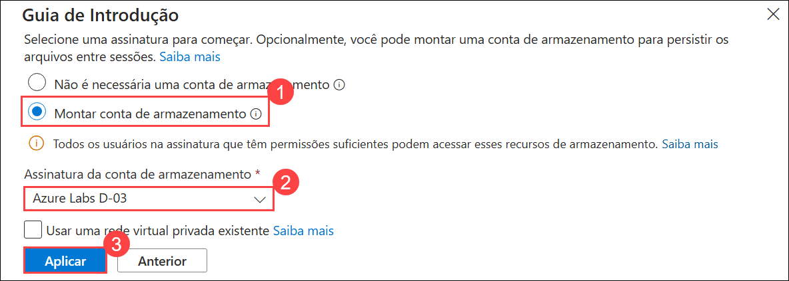
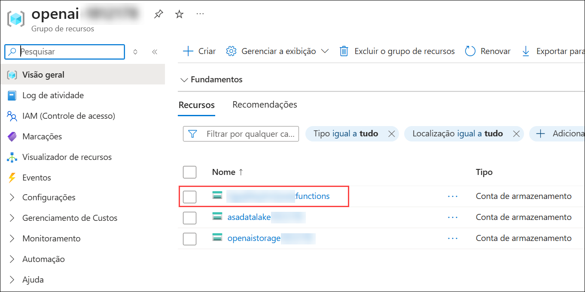
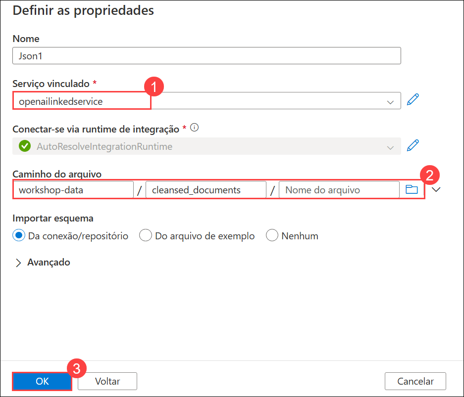
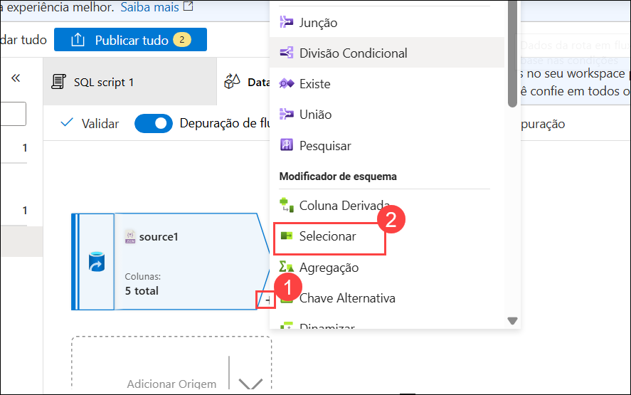

# Exercício 1: Construir um Pipeline OpenAI para Ingerir Dados em Lote, Executar Operações Inteligentes e Analisar no Synapse

### Duração Estimada: 120 Minutos

Este exercício tem como objetivo demonstrar como integrar os recursos do OpenAI ao Azure Synapse Analytics para processar dados em lote, executar operações inteligentes como processamento de linguagem natural ou análise preditiva e analisar os resultados de forma eficiente no ambiente Synapse.

## Objetivos do Laboratório

Você será capaz de completar as seguintes tarefas:

- Tarefa 1: Ingestão de Dados na conta de armazenamento
- Tarefa 2: Configuração do Workspace do Synapse 
- Tarefa 3: Consulta dos Resultados na tabela SQL

## Tarefa 1: Ingestão de Dados na conta de armazenamento

Esta tarefa foca na ingestão de dados em uma Conta de Armazenamento do Azure (Azure Storage Account). Envolve o upload ou a transferência de conjuntos de dados (datasets) para o armazenamento em nuvem de maneira estruturada e segura. Os dados armazenados serão utilizados para processamento e análise posteriores no pipeline de IA.

### A. Iniciar o Azure Cloud Shell

1. No [Portal de Azure](https://portal.azure.com?azure-portal=true), selecione o botão **[>_]** (*Cloud Shell*) no topo da página, à direita da caixa de busca. Um painel do Cloud Shell será aberto na parte inferior do portal.

   

1. Na primeira vez que abrir o Cloud Shell, você poderá ser solicitado a escolher o tipo de shell que deseja usar (*Bash* ou *PowerShell*). Selecione **Bash**. Se você não vir esta opção, pode avançar para o próximo passo.

   

1. No painel Guia de Introdução, selecione **Montar conta de armazenamento (1)**, selecione sua **Assinatura de conta de armazenamento (2)** no menu suspenso e clique em **Aplicar (3)**.

   

1. Dentro do painel **Montar conta de armazenamento**, escolha **Selecione uma conta de armazenamento existente (1)** e clique **Avançar (2)**.

   

1. No painel **Configurações avançadas**, insera os seguintes dados:

    - **Assinatura:** Escolha a única assinatura existente atribuída para este laboratório. **(1)**.
    - **Grupo de recursos:** Selecione **Usar existente** **(2)**
      - openai-<inject key="DeploymentID" enableCopy="false"></inject>
    - **Nome da conta de armazenamento:** Selecione **Usar existente** **(3)**
      - openaistorage<inject key="DeploymentID" enableCopy="false"></inject>
    - **Compartilhamento de arquivos:** Criar um novo compartilhamento de arquivo **(4)**

      

1. Insira o nome do compartilhamento de arquivos **(Novo) blob (1)**, e clique em **Selecionar (2)**.

    

1.  Assim que a conta de armazenamento for criada, você verá à janela do Bash, conforme mostrado na captura de tela abaixo.
    
    

    > **Observação:** desconsidere o aviso `o ID de assinatura do compartilhamento de arquivo de armazenamento não está registrado no Microsoft.CloudShell Namespace` e prossiga com a próxima tarefa.

### B. Carregar arquivos para uma conta de armazenamento:

1. Execute os seguintes comandos no Cloud Shell para baixar e instalar o Miniconda. 

     ```bash 
     wget https://repo.anaconda.com/miniconda/Miniconda3-py39_23.1.0-1-Linux-x86_64.sh 
     ```

     ```bash 
     sh Miniconda3-py39_23.1.0-1-Linux-x86_64.sh 
     ```
    
    > **Observação:**  Os comandos a seguir são executados em Bash; por favor, certifique-se de que você está usando **Bash** no Cloud Shell.

1. Pressione `Enter` para continuar o processo de instalação.

    >**Observação:** Pressione a tecla de seta para baixo para ler ou pular o contrato de licença.

    

1. Digite **yes** e pressione **enter** para aceitar o acordo, e pressione enter para instalar no caminho padrão.

   

1. Digite **yes** e pressione **enter** para inicializar o ambiente conda.

    

    > **Observação:** Assim que o ambiente conda estiver instalado, você poderá ver a mensagem de saída como esta.

     

1. Execute os comandos abaixo um por um para criar e ativar o ambiente conda no CloudShell.

    ```bash 
    git clone https://github.com/CloudLabsAI-Azure/openaifilesworkshop.git
    ```

    ```bash
    cd openaifilesworkshop/scenarios/openai_batch_pipeline/document_generation
    ```

    ```bash
    source ~/.bashrc
    ```

    ```bash
    conda --version
    ```
    
    ```bash
    conda create -n document-creation
    ```

    ```bash
    conda activate document-creation
    ```

    > **Observação:** Se você encontrar o erro **"Conda: command not found"** após executar este comando, feche sua sessão atual do CloudShell, inicie uma nova sessão Bash e, em seguida, tente executar os comandos mencionados abaixo e, depois, os comandos do **Passo 6** novamente.

    ```bash
    pip install --upgrade pip
    pip install -r reqs.txt
    ```

    > **Nota:** Se você encontrar erros ao executar os comandos pip acima, execute os comandos abaixo:
    >
    >     pip install --user --upgrade pip
    >     pip install --user -r reqs.txt
    
1. Digite **y** e pressione Enter para prosseguir.
   > **Nota:** Prossiga para a próxima etapa se esta solicitação não aparecer para você.

1. Navegue até o grupo de recursos **openai-<inject key="DeploymentID" enableCopy="false"/>** e, em seguida, selecione sua Conta de Armazenamento com o sufixo azfunctions na lista de recursos.

    

1. No menu lateral esquerdo, localize na seção **Segurança + rede** a opção **Chaves de acesso (1)**. Em seguida, selecione **Mostrar (2)** para revelar o valor da cadeia de conexão. Agora, clique no botão de cópia ao lado da primeira **cadeia de conexão (3)**. Por fim, cole o valor copiado em um editor de texto, como o Bloco de Notas, para referência posterior.

   

1. Volte para a sessão Bash do Cloud Shell e execute o comando abaixo para fazer o upload dos arquivos JSON para uma conta de armazenamento, atualizando a <CONNECTION_STRING> copiada na etapa anterior. Este passo levará alguns minutos para ser concluído.

    ```bash 
    python upload_docs.py --conn_string "<CONNECTION_STRING>"
    ```

   

   > **Observação:** Certifique-se de estar no diretório **openaifilesworkshop/scenarios/openai_batch_pipeline/document_generation** antes de executar o comando. Se você ainda não estiver neste diretório, use o seguinte comando para navegar até ele:
   
   >```bash
   >cd openaifilesworkshop/scenarios/openai_batch_pipeline/document_generation
   >```   
   > Quando estiver no diretório correto, você pode executar o comando necessário.

1. Assim que os arquivos JSON forem carregados com sucesso para a conta de armazenamento, navegue até **Contêineres (1)**, clique em **workshop-data (2)**, selecione a pasta **cleansed_documents (3)** e verifique se os arquivos foram carregados.

   

   

> **Parabéns** por completar a tarefa! Agora, é hora de validá-la. Aqui estão os passos:
> - Se receber uma mensagem de sucesso, você pode prosseguir para a próxima tarefa.
> - Caso contrário, leia atentamente a mensagem de erro e repita o passo, seguindo as instruções do guia do laboratório.
> - Se precisar de ajuda, entre em contato conosco pelo e-mail cloudlabs-support@spektrasystems.com. Estamos disponíveis 24 horas por dia, 7 dias por semana, para ajudar.   

<validation step="ef9a8088-8af2-426f-9672-70c0b0c227b5" />

## Tarefa 2: Configuração do Workspace do Synapse

Esta tarefa envolve a configuração de um Workspace do Azure Synapse para permitir a integração de dados, análise e criação de pipelines. Inclui a configuração dos recursos necessários, a vinculação de contas de armazenamento e a preparação do ambiente do workspace para executar fluxos de trabalho de dados e operações de IA.

### **A. Configurar o Workspace do Synapse**

1. No portal do Azure, procure **Synapse** e selecione **Azure Synapse Analytics**.

   

1. Na página do **Azure Synapse Analytics**, clique em **+ Criar**.

   

1. Você será direcionado para a página **Criar Synapse Analytics**, onde configurará o workspace do Synapse.

1. Na aba **Básico**, forneça os seguintes dados:

   - **Assinatura:** Use **Assinatura Existente(1)**.
   - **Grupo de recursos:** use **openai-<inject key="DeploymentID" enableCopy="false"></inject>(2)**
   - **Nome do espaço de trabalho:** **synapseworkspace<inject key="DeploymentID" enableCopy="false"></inject>(3)**
   - **Região:** Selecione a região padrão(4)
   - **Selecione Data Lake Storage Gen2:** Selecione **Da assinatura(5)**
   - **Nome da conta:** **asadatalake<inject key="DeploymentID" enableCopy="false"></inject>(6)**
   - **Nome do sistema de arquivos:** **defaultfs(7)**
   - Clique em **Próximo: Segurança>(8)**
  
     

1. Na aba **Segurança**, certifique-se de que o método de autenticação esteja definido como **Usar a autenticação local e a autenticação do Microsoft Entra ID (1)** e clique em **Próximo: Rede (2)**

   -1.png)

1. Na aba **Rede**, certifique-se de que a rede virtual gerenciada esteja **Desabilitar (1)** e **Permitir conexões de todos os endereços IP (2)** esteja marcada e clique em **Examinar + Criar (3)** e *Criar* para implantar o recurso.

   -1.png)

   > **Nota:** A implantação pode levar aproximadamente 5 minutos para ser concluída.

1. Assim que o recurso for implantado, clique em **Ir para o grupo de recursos**.

    

1. Navegue até o espaço de trabalho do Synapse que você criou, na página **Visão geral (1)**, clique em **Abrir (2)** em Abrir Synapse Studio para navegar até o Azure Synapse Studio.

   

1. No Azure Synapse Studio, navegue até **Manage (1) > SQL pools (2)** e clique em **+Novo (3)**

      

1. Na aba *Basics* do novo pool de SQL dedicado, forneça os seguintes detalhes:

      - **Nome do pool de SQL dedicado: openaisql01** **(1)**
      
      - **Nível de desempenho:** Reduza para **DW100c** **(2)**
      
      - Clique em **"Examinar e Criar"** **(3)**

        

1. Na página **Revisar + criar**, clique em **Criar** e aguarde a conclusão da implantação.

      

   > **Nota:** A implantação pode levar aproximadamente 10 minutos para ser concluída.

1. Agora navegue de volta ao portal do Azure, em **synapseworkspace<inject key="DeploymentID" enableCopy="false"></inject>**, na seção **Pools de análise**, selecione **Pools do Apache Spark(1)** e clique em **+ Novo (2).**

     

1. Na página Novo pool do Apache Spark, forneça os seguintes dados e clique em **Examinar + criar (6)**, depois clique na guia **Criar** para criar o pool do Apache Spark.

   - **Nome do pool do Apache Spark:** **openaisparkpool (1)**
   
   - **Tamanho do nó:** **Small (4 vCores/32 GB) (2)**
   
   - **Dimensionamento Automático:** **Desativado (3)**
   
   - **Número de nós:** **3 (4)**
   
      

### **B. Criar tabela SQL de Destino**

1. No [Portal de Azure](https://portal.azure.com), navegue até ao synapse workspace **synapseworkspace<inject key="DeploymentID" enableCopy="false"/>** a partir do grupo de recursos **openai-<inject key="DeploymentID" enableCopy="false"/>**. Na aba **Visão geral (1)**, clique em **Abrir (2)** para iniciar o workspace do Synapse.

      

1. Clique na seção **Develop (1)** no Synapse Studio, clique em **+ (2)** faça login no topo esquerdo e selecione **Script SQL (3)**. Isso abrirá uma nova janela com um editor de script SQL.

      

1. Copie e cole o seguinte script no editor **(1)**, em seguida, altere o valor **Conectar-se com** selecionando **openaisql01(2)** no menu suspenso. Para **Usar banco de dados**, confirme que **openaisql01(3)** está selecionado, e clique no botão **Executar (4)** no canto superior esquerdo, como mostra a imagem abaixo. Conclua esta etapa pressionando **Publicar tudo (5)** logo acima do botão **Executar** para publicar nosso trabalho até agora.

    ```SQL 
    CREATE TABLE [dbo].[cs_detail]
    (
    interaction_summary varchar(8000),
    sentiment varchar(500),
    topic varchar(500),
    product varchar(500),
    filename varchar(500)
    )
    ```
    
    
    
1. Em seguida, clique em **Publicar** para publicar o script SQL.

      

### **C. Criar Serviços Vinculados de Origem e Destino**

A seguir, precisaremos criar dois serviços vinculados (linked services): um para nossa origem (os arquivos JSON no Data Lake) e outro para o Banco de Dados SQL do Synapse que abriga a tabela que criamos na etapa anterior

1. Clique novamente na seção **Manage (1)** do Synapse Studio e clique na opção **Linked services (2)** na seção **External connections**. Em seguida, clique em **+ Novo (3)** no canto superior esquerdo.

      
   
1. Comece criando o serviço vinculado para a fonte de dados — os arquivos JSON armazenados na conta de armazenamento ADLS Gen2 criada com o modelo inicial. Na barra de pesquisa que é aberta depois de clicar em Novo, procure **blob (1)**, selecione **Armazenamento de Blob do Azure (2)** conforme descrito abaixo e clique em **Continuar (3)**.

      

1. Forneça o nome do seu serviço vinculado como **openailinkedservice (1)**. Altere o **Tipo de Autenticação** para **Chave de Conta (2)**. Em seguida, selecione a **assinatura (3)** com a qual você está trabalhando e, por fim, selecione a conta de armazenamento com o sufixo **functions (4)** que você criou no modelo inicial e para a qual carregou os arquivos JSON. Em sequência, clique em **Testar Conexão (5)**. Após a conexão ser bem-sucedida, clique no botão azul **Criar (6)** no canto inferior esquerdo da janela Novo Serviço Vinculado.

      

1. Ainda na tela de **Serviços Vinculados**, clique em **+ Novo** no canto superior esquerdo. Procure **Synapse (1)**, selecione **Azure Synapse Analytics (2)**, e clique em **Continuar (3)**.

      

1. Na janela Novo Serviço Vinculado que se abre, preencha o nome com **synapselinkedservice(1)**, **Versão: 1.0(2)**. Selecione a **Assinatura do Azure (3)**  na qual você tem trabalhado. Selecione **synapseworkspace<inject key="DeploymentID" enableCopy="false"/> (4)** para **Nome do servidor** e **openaisql01 (5)** como o **Nome do Banco de Dados**. Certifique-se de alterar o **Tipo de autenticação** para **Identidade gerenciada atribuída pelo sistema (6)**, depois clique em **Testar conexão (7)** e clique em **Criar (8)**.

      

      

1. Depois que ambos os serviços vinculados forem criados, clique em **Publicar tudo** no topo do Synapse Studio e, em seguida, clique em **Publicar**.

      
   
### **D. Criar Fluxo de Dados do Synapse**

Ainda no Synapse Studio, vamos agora criar um **Fluxo de dados** para inserir os nossos dados JSON e gravá-los em nosso banco de dados SQL. Este fluxo de dados irá ingerir os dados, renomear algumas colunas e gravá-los na tabela de destino.

1. Retorne para a aba **Develop (1)**, clique no ícone **+ (2)**, e selecione **Fluxo de dados (3)**.

      
   
1. Assim que o editor do fluxo de dados abrir, clique em **Adicionar Origem**. Uma nova janela será aberta na parte inferior da tela. Selecione **+ Novo** na linha **Conjunto de Dados** deixando as outras opções como padrão.

      

1. No painel à direita, procure por **Armazenamento de Blob do Azure (1)**, selecione **Armazenamento de Blobs do Azure (2)**, e clique em **Continuar (3)**.
   
      

1. Em seguida, selecione a opção **JSON (1)** pois os nossos dados de entrada estão no formato JSON e clique em **Continuar (2)**.

      

1. Selecione o serviço vinculado chamado **openailinkedservice (1)** que foi criado anteriormente. Você precisará selecionar o **Caminho do arquivo** e o diretório onde os arquivos JSON estão armazenados. Deve ser algo semelhante a **workshop-data / cleansed_documents (2)**. Clique no botão **OK (3)** para fechar a janela.

      
   
1. Em seguida, precisaremos ir para o painel **Opções de origem (1)** e listar as opções **Configurações de JSON (2)**. Precisamos alterar a opção **Formulário de Documento** para a configuração **Array of documents (3)**. Isso permite que nosso fluxo leia cada arquivo JSON como uma entrada separada em nosso banco de dados.

      

1. Ative a opção **Depuração de fluxo de dados** localizada na barra de menu superior e clique em **OK** na janela pop-up *Turn on data flow debug*.

      >**Observação:** Levará um ou dois minutos para que a sessão **Depuração de fluxo de dados** seja ativada.

1. Navegue até ao separador **Visualização de dados** e execute uma visualização para verificar seu trabalho até agora.
    
      

      >**Observação:** Se a **Visualização de dados** não aparecer imediatamente, clique no botão **Atualizar** repetidamente até que os dados sejam carregados.
   
1. A seguir, vamos adicionar o bloco **Selecionar** e fazer nossas pequenas alterações antes de gravar os dados na tabela SQL do Synapse. Para começar, clique no pequeno sinal **+ (1)** ao lado do nosso bloco de ingestão e escolha a opção **Selecionar (2)**.

    

1. Podemos deixar todas as configurações como padrão. Em seguida, adicionaremos nosso bloco **Coletor** (Destino). . Este é o passo que gravará nossos dados em nosso banco de dados SQL do Synapse. Clique no pequeno sinal **+ (1)** o lado do nosso bloco **Selecionar**. até a parte inferior do menu de opções e selecione a opção **Coletor (2)**.

      

1. Quando o bloco **Coletor (1)** abrir, escolha **Embutido (2)** para o *Tipo de Coletor*. Em seguida, selecione **Azure Synapse Analytics (3)** para o *Tipo de Conjunto de dados embutido*, e para o **Serviço vinculado**, selecione **Synapselinkedservice (4)**, que foi criado na etapa anterior. Certifique-se de executar **Testar conexão (5)** para o linked service.

   

      > **Nota:** Se a conexão de teste demorar mais de 3 a 4 minutos, siga os passos abaixo.

      - Clique em **Edit**.
        
               

      - Na janela Editar linked service que se abre, selecione o método de seleção de conta como **From Azure subscription** **(1)**. Selecione a **Subscrição do Azure (2)** para a qual você tem trabalhado. Selecione **asaworkspace<inject key="DeploymentID" enableCopy="false"/> (3)** para **Nome do servidor** e **openaisql (4)** como o **Nome do Banco de Dados**, clique em **Testar conexão (5)** e clique em **Salvar (6)**.

           

           

1. Em seguida, precisaremos ir para a aba **Configurações (1)** e ajustar o **Nome do esquema** e **Nome da tabela**. Se você utilizou o script fornecido anteriormente para criar a tabela de destino, o nome do esquema é **dbo (2)** e o nome da tabela é **cs_detail (3)**.

      

1. Antes de finalizarmos nosso trabalho no fluxo de dados, devemos pré-visualizar nossos dados. A pré-visualização de nossos dados revela que temos apenas 3 colunas, quando esperamos um total de 5. Perdemos nossas colunas Summary e Sentiment.

      

1. Para corrigir isso, vamos usar nosso bloco **Select (1)** para alterar os nomes da seguinte forma para obter os valores de saída esperados:

     - **Summary:** `interaction_summary` **(2)**
     - **CustomerSentiment:** `sentiment` **(3)**

          
    
1. Retorne para o bloco **Sink (1)**, vá para a aba **Pré-visualização de dados (2)** e clique **Atualizar (3)**, para verificar se todas as 5 colunas aparecem corretamente.

      

1. Depois de revisar os dados e estar satisfeito que todas as colunas foram mapeadas com êxito (você deve ter 5 colunas no total, todas mostrando dados em um formato tipo string), podemos clicar em **Publish all** na parte superior para salvar nossa configuração atual. No painel de confirmação que se abre, clique no botão azul **Publish** para salvar sua configuração.

      

1. Seu fluxo de dados concluído e salvo deve se assemelhar à estrutura mostrada abaixo.

      

### **E. Criar um Pipeline no Synapse**

1. Após criar o **Fluxo de dados**,  o próximo passo é configurar um **Pipeline** para contê-lo. Para criar um **Pipeline**,  navegue até a barra de menu à esquerda e escolha a opção **Integrate (1)**. Em seguida, clique no botão **+ (2)** a parte superior do menu Integrar para **Adicionar um novo recurso** e escolha **Pipeline (3)**.

      

2. A seguir, precisamos adicionar um **Fluxo de dados** ao nosso Pipeline. Com sua nova **aba Pipeline (1)** aberta, vá para a seção **Atividades** e procure por `data` **(2)** e selecione a atividade **Fluxo de dados (3)** e **arraste e solte (4)** em seu Pipeline.

      

3. Na aba **Configurações (1)** do **Fluxo de dados**, use o menu suspenso **Fluxo de dados (2)** para selecionar o fluxo que você criou anteriormente. Expanda a seção **Preparando (3)** na parte inferior das configurações e utilize o menu suspenso para o **Preparo do serviço vinculado**. Escolha o linked service que você criou **openailinkedservice (4)** para garantir a **Testar conexão (5)**. Em seguida, defina uma **Pasta de armazenamento de preparação** na parte inferior e digite **workshop-data/Staging** **(6)**.

      

4. Em seguida, clique em **Publicar tudo** para publicar as alterações efetuadas e salvar o seu progresso.

### **F. Executar um Pipeline no Synapse**

1.  Uma vez que o pipeline esteja publicado, você pode dispará-lo clicando no ícone de *raio*  **Adicionar gatilho (1)**. Clique para adicionar um trigger e selecione **Disparar agora (2)** para iniciar uma execução de pipeline e, quando a janela abrir, clique em **OK**.

      
    
5. Para ver a execução do pipeline, navegue até o lado esquerdo da tela e escolha a opção **Monitor (1)**. Em seguida, selecione a opção **Pipeline runs (2)** na seção **Integration**. Em seguida, você verá a execução do pipeline que você acionou na seção **Disparado (3)** como **pipeline 1 (4)**.  Este pipeline deve levar aproximadamente 4 minutos (se você estiver usando os dados carregados para o workshop).

      

> **Parabéns** por completa a tarefa! Agora, é hora de validá-la. Aqui estão os passos:
> - Se receber uma mensagem de sucesso, você pode prosseguir para a próxima tarefa.
> - Caso contrário, leia atentamente a mensagem de erro e repita o passo, seguindo as instruções do guia do laboratório.
> - Se precisar de ajuda, entre em contato conosco pelo e-mail cloudlabs-support@spektrasystems.com. Estamos disponíveis 24 horas por dia, 7 dias por semana, para ajudar.

<validation step="3e716f01-6da8-431e-aa81-4041b9054091" />    

## Tarefa 3: Consulta dos Resultados na tabela SQL

Esta tarefa foca na consulta de dados armazenados em uma tabela SQL dentro do Azure Synapse. Isso envolve escrever e executar consultas SQL para recuperar, filtrar e analisar os dados ingeridos, com o objetivo de realizar processamentos adicionais ou validações.

1. Certifique-se de que o status de execução do pipeline foi **Bem-sucedido**.

      

2. Agora que os dados estão na tabela de destino, você pode começar a consultá-los ou conectá-los ao Power BI para visualização. Para explorar os resultados, envie os arquivos de transcrição para a pasta generated_documents. Você verá novos arquivos, agora limpos, sendo gerados na pasta cleansed_documents.

3. Para consultar os novos dados, navegue até o menu do lado esquerdo e escolha **Develop (1)**. Clique no **SQL Script (2)** existente e substitua o conteúdo pelo **código SQL (3)** abaixo. Em seguida, selecione **openaisql (4)** como o pool SQL e clique em **Run (5)**. 

     ```SQL 
     SELECT sentiment, count(*) as "Sum of Sentiment"
     FROM [dbo].[cs_detail]
     GROUP BY sentiment
     ORDER BY count(*) desc     
     ```
     
   - Os resultados da sua consulta, se você estiver usando os arquivos carregados como parte deste repositório ou do workshop, você verá **Results (6)** semelhantes aos abaixo.

        

## Resumo

Neste exercício, você ingeriu dados com sucesso em uma conta de armazenamento, criou um workspace do Synapse, construiu um pipeline e um fluxo de dados, e consultou os resultados em uma tabela SQL.

### Você concluiu o exercício com sucesso. Clique em **Próximo >>** para prosseguir com o próximo exercício.


