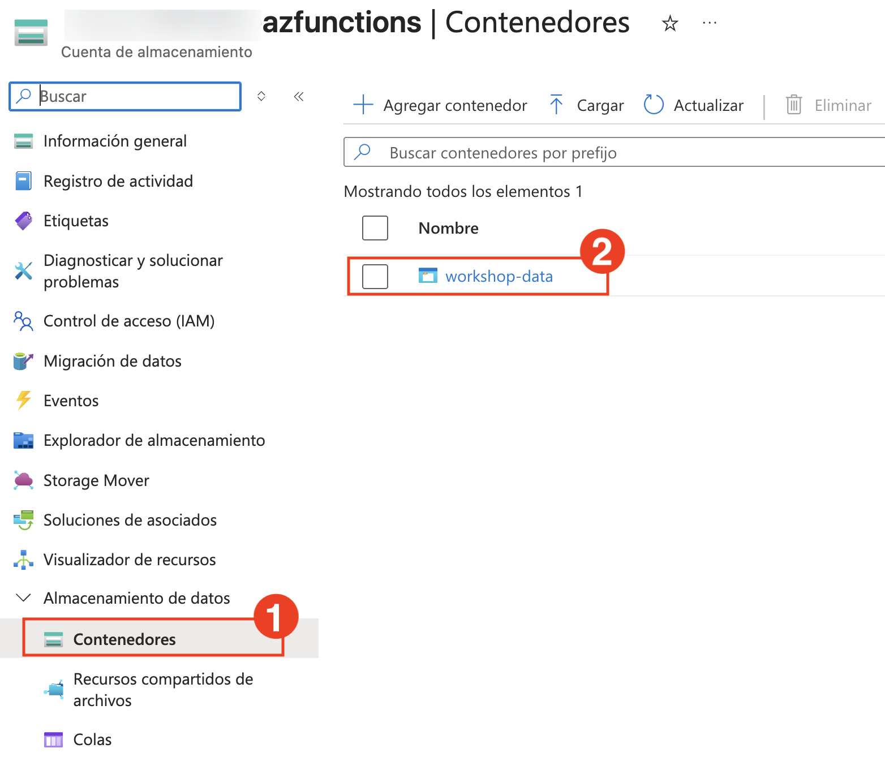
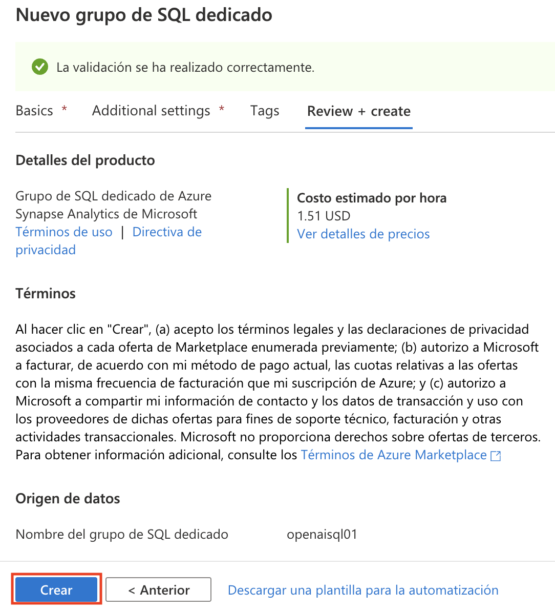
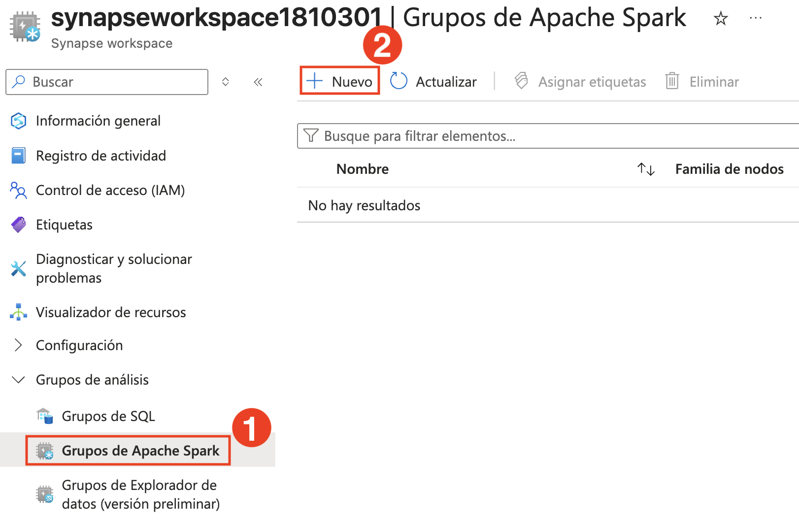
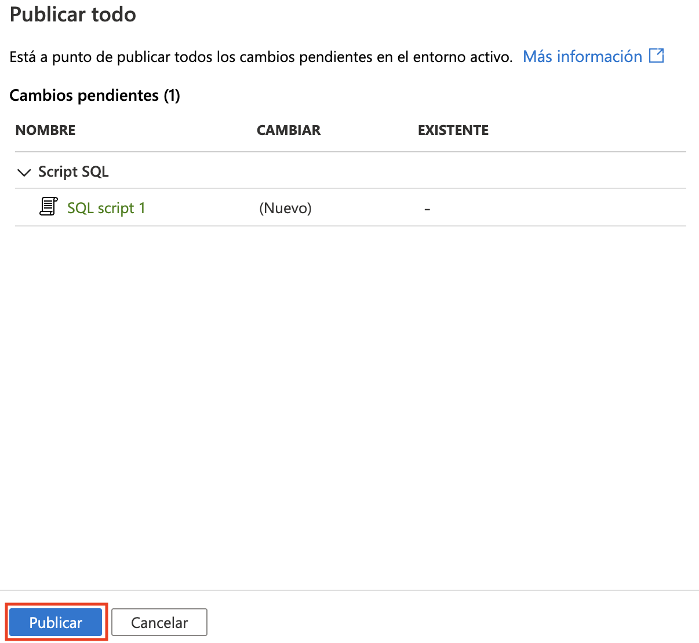
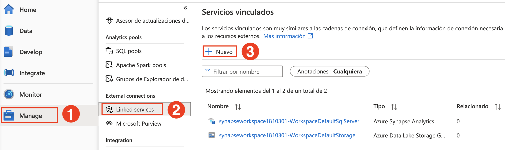
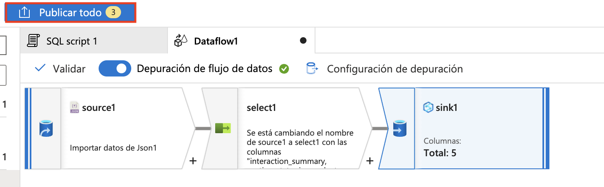
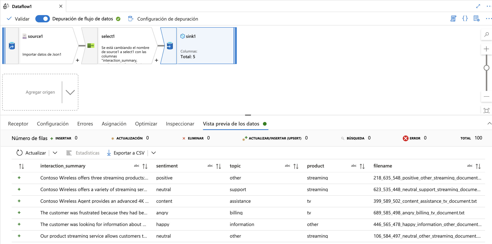

# Ejercicio 1: Crear un Pipeline de Open AI para Ingerir Datos por Lotes, Realizar Operaciones Inteligentes y Analizar en Synapse

### Duración estimada: 120 minutos

En este ejercicio, integrará las funcionalidades de OpenAI en Azure Synapse Analytics para procesar datos por lotes, realizar operaciones inteligentes como el procesamiento del lenguaje natural o el análisis predictivo, y analizar los resultados de forma eficiente en el entorno de Synapse.

## Objetivos del Laboratorio

Será capaz de completar las siguientes tareas:

- Tarea 1: Ingesta de Datos en la Cuenta de Almacenamiento
- Tarea 2: Configurar un área de trabajo de Synapse
- Tarea 3: Consultar Resultados en Nuestra Tabla SQL

## Tarea 1: Ingesta de Datos en la Cuenta de Almacenamiento

Esta tarea se centra en la ingesta de datos en una cuenta de Azure Storage. Implica cargar o transferir conjuntos de datos al almacenamiento en la nube de forma estructurada y segura. Los datos almacenados se utilizarán para su posterior procesamiento y análisis en el pipeline de IA.

### A. Iniciar Azure Cloud Shell

1. En el [Portal de Azure](https://portal.azure.com?azure-portal=true), seleccione el botón **[>_]** (*Cloud Shell*) ubicado en la parte superior de la página a la derecha de la caja de de búsqueda. Se abrirá un panel de Cloud Shell en la parte inferior del portal. 

    

2. La primera vez que abra Cloud Shell, es posible que se le solicite que elija el tipo de Shell que desea usar (*Bash* o *PowerShell*). Seleccione **Bash**. Si no ve esta opción, omita el paso.

    

3. En el panel Introducción, seleccione **Montar cuenta de almacenamiento (1)**, seleccione su **suscripción de Cuenta de Almacenamiento (2)** del menú desplegable y haga clic en **Aplicar (3)**. 

   

4. En el panel **Montar cuenta de almacenamiento**, elija **Seleccionar cuenta de almacenamiento existente (1)** y haga clic en **Siguiente (2)**.

   

5. Dentro del panel **Configuración Avanzada**, ingrese los siguientes detalles:

    - **Suscripción**: Predeterminada- Elija la única suscripción existente asignada para esta práctica de laboratorio (1).
    - **Grupo de Recursos**: Elija **Usar existente** **(2)**
      - openai-<inject key="DeploymentID" enableCopy="false"></inject>
    - **Cuenta de Almacenamiento**: Elija **Usar existente** **(3)**
      - openaistorage<inject key="DeploymentID" enableCopy="false"></inject>
    - **Recurso compartido de archivos**: crear un recurso compartido de archivos **(4)**

      .png)

1. Ingrese el nombre del recurso compartido de archivos como **blob (1)**, seleccione **Aceptar** y haga clic en **Seleccionar (2)**.

    .png)

1.  Una vez creada la cuenta de almacenamiento, aparecerá la ventana Bash, tal como se muestra en la siguiente captura de pantalla:
    
    

    > **Nota**: ignore la advertencia `El ID de suscripción del recurso compartido de archivos de almacenamiento no está registrado en el espacio de nombres Microsoft.CloudShell` y continúe con la siguiente tarea.

### B. Cargar archivos a una cuenta de almacenamiento:

1. Ejecute los siguientes comandos en Cloud Shell para descargar e instalar Miniconda.

     ```bash 
     wget https://repo.anaconda.com/miniconda/Miniconda3-py39_23.1.0-1-Linux-x86_64.sh 
     ```

     ```bash 
     sh Miniconda3-py39_23.1.0-1-Linux-x86_64.sh 
     ```
    
    > **Nota:** Los siguientes comandos funcionan en Bash; asegúrese de utilizar **Bash** en Cloud Shell. 
    
    > **Nota:** Presione la tecla de flecha hacia abajo para leer u omitir el acuerdo de licencia.

1. Pulse `Enter` para continuar con la instalación.

   > **Nota:** Pulse la flecha hacia abajo para leer u omitir el acuerdo de licencia.

   

1. Escriba **yes** y presione **Enter** para aceptar el acuerdo, y luego presione **Enter** para instalar en la ruta predeterminada. 

   

1. Escriba **yes** y presione **enter** para inicializar el entorno de conda.

    

1. Una vez instalado el entorno conda, podrá ver un mensaje de salida como este.

        

1. Ejecute los siguientes comandos uno por uno para crear y activar el entorno conda en CloudShell.

    ```bash 
    git clone https://github.com/CloudLabsAI-Azure/openaifilesworkshop.git
    ```

    ```bash
    cd openaifilesworkshop/scenarios/openai_batch_pipeline/document_generation
    ```

    ```bash
    source ~/.bashrc
    ```

    ```bash
    conda --version
    ```

    ```bash
    conda create -n document-creation
    ```

    ```bash
    conda activate document-creation
    ```

    > **Nota:** Si encuentra el error **"Conda: command not found"** después de ejecutar este comando, cierre su sesión actual de CloudShell, inicie una nueva sesión de Bash, intente ejecutar los comandos mencionados a continuación y luego los del **Paso 6** nuevamente.

    ```bash
    pip install --upgrade pip
    pip install -r reqs.txt
    ```

    > **Nota:** Si encuentra errores al ejecutar los comandos pip anteriores, ejecuta los siguientes comandos:
    >
    >     pip install --user --upgrade pip
    >     pip install --user -r reqs.txt
    
1. Presione la tecla **y** y luego presione Enter para continuar.
    > **Nota:** Continue con el siguiente paso si no se le solicita esto.

1. Navegue hasta el grupo de recursos **openai-<inject key="DeploymentID" enableCopy="false"/>** y luego seleccione su cuenta de almacenamiento con el sufijo `azfunctions` de la lista de recursos.

    
    
1. Cambie a la hoja **Claves de acceso (1)**, ubicada en la sección **Seguridad y redes**. A continuación, seleccione **Mostrar (2)** para ver el valor de la cadena de conexión. Haga clic en el botón Copiar junto a la primera **cadena de conexión (3)**. Finalmente, pegue el valor copiado en un editor de texto, como el Bloc de Notas, a fin de poderlo consultar más adelante. 

   

1. Vuelva a la sesión de bash de Cloud Shell y ejecute el siguiente comando para cargar los archivos JSON en la cuenta de almacenamiento reemplazando <CONNECTION_STRING> por el valor que copió en el paso anterior. Esto tardará unos minutos en completarse.

    ```bash 
    python upload_docs.py --conn_string "<CONNECTION_STRING>"
    ```

   

   > **Nota**: Asegúrese de estar en el directorio **openaifilesworkshop/scenarios/openai_batch_pipeline/document_generation** antes de ejecutar el comando. Si aún no está en este directorio, use el siguiente comando para acceder a él:

   ```bash
   cd openaifilesworkshop/scenarios/openai_batch_pipeline/document_generation
   ```   

    > **Nota:** Si encuentra errores al ejecutar los comandos pip anteriores, ejecuta los siguientes comandos:
    >
    >     pip install --user --upgrade pip
    >     pip install --user -r reqs.txt


1. Una vez que haya cargado exitosamente los archivos JSON a la cuenta de almacenamiento, navegue a **Contenedores (1)** en la sección **Almacenamiento de datos**. Haga clic en **workshop-data (2)**, seleccione la carpeta **cleansed_documents (3)** y verifique que los archivos se hayan cargado.

   


   


> **¡Felicitaciones!** por completar la tarea. Ahora es momento de validarla. Estos son los pasos:
> - Si recibe un mensaje de éxito, puede continuar con la siguiente tarea.
> - De lo contrario, lea atentamente el mensaje de error y vuelva a intentar el paso siguiendo las instrucciones de la guía del laboratorio.
> - Si necesita ayuda, contáctenos en cloudlabs-support@spektrasystems.com. Estamos disponibles 24/7 para ayudarle.

<validation step="ef9a8088-8af2-426f-9672-70c0b0c227b5" />

## Tarea 2: Configurar un área de trabajo de Synapse

Esta tarea implica configurar un área de trabajo de Azure Synapse para facilitar la integración, el análisis y la creación de pipelines de datos. Incluye la configuración de los recursos necesarios, la vinculación de cuentas de almacenamiento y la preparación del entorno del área de trabajo para ejecutar flujos de trabajo de datos y operaciones de IA.

### **A. Configurar un área de trabajo de Synapse**

1. En el Portal de Azure, busque **Synapse** y seleccione **Azure Synapse Analytics**.

   .png)

2. En la página **Azure Synapse Analytics**, haga clic en **+ Crear**.

   

3. Se le dirigirá a la página **Crear Synapse Analytics** donde configurará el espacio de trabajo de Synapse.

4. En la pestaña **Conceptos básicos**, proporcione los siguientes detalles:

   - **Suscripción**: Utilice **Suscripción existente(1)**.
   - **Grupo de recursos**: Utilice **openai-<inject key="DeploymentID" enableCopy="false"></inject>(2)**
   - **Nombre del espacio de trabajo**: **synapseworkspace<inject key="DeploymentID" enableCopy="false"></inject>(3)**
   - **Región**: Seleccione la región predeterminada (4)
   - **Seleccione Data Lake Storage Gen2**: Seleccione **De la suscripción(5)**
   - **Nombre de cuenta**: Seleccione **asadatalake<inject key="DeploymentID" enableCopy="false"></inject>(6)**
   - **Nombre del sistema de archivos**: **defaultfs(7)**
   - Haga clic en **Siguiente: Seguridad>(8)**

     .png)

5. En la pestaña **Seguridad**, asegúrese de que el método de autenticación esté configurado en **Usar tanto la autenticación local como de Microsoft Entra ID** y haga clic en **Siguiente: Networking**

   .png)

6. En la pestaña de redes, asegúrese de que la opción Red virtual administrada esté en **Deshabilitar (1)** y que la opción **Permitir conexiones de todas las direcciones IP (2)** esté marcada, luego haga clic en **Revisar + crear** y **Crear** para implementar el recurso.

   .png)

   > **Nota:** La implementación puede tardar aproximadamente 5 minutos en completarse.


7. Una vez implementado el recurso, haga clic en **Ir al grupo de recursos**

   .png)

8. En la página **Información general (1)** del área de trabajo de Synapse que creó, haga clic en **Abrir (2)** en **Abrir Synapse Studio** para navegar a Azure Synapse Studio.

   

9. En Azure Synapse Studio, navegue a **Manage (1) > SQL pools (2)** y luego haga clic en **+ Nuevo (3)** para crear un nuevo grupo SQL.

    

10. En la pestaña **Conceptos básicos** del Nuevo grupo de SQL dedicado, proporcione los siguientes detalles:

    - **Nombre del grupo de SQL dedicado**: **openaisql01**
    - **Nivel de rendimiento**: Reducirlo a **DW100c**
    - Haga clic en **Revisar + crear**

      

11. En la página **Revisar + crear**, haga clic en **Crear** y espere a que se complete la implementación.

    

    > **Nota**: La implementación puede tardar aproximadamente 10 minutos en completarse.    

12. Ahora regrese a **synapseworkspace<inject key="DeploymentID" enableCopy="false"></inject>**, seleccione **Grupos de Apache Spark (1)** en el panel izquierdo debajo de **Grupos de análisis** y haga clic en **+ Nuevo (2)** para crear un nuevo grupo de Spark.

    

13. En la página **Nuevo grupo de Apache Spark**, proporcione los siguientes detalles y haga clic en **Revisar + crear (6)**, luego haga clic en la pestaña **Crear** para crear el grupo de Apache Spark.

    - **Nombre del grupo de Apache Spark**: **openaisparkpool (1)**

    - **Proceso aislado**: **Deshabilitado (2)**

    - **Tamaño de nodo**: **Pequeño (4vCores/32GB) (3)**

    - **Escalabilidad automática**: **Deshabilitado (4)**

    - **Número de nodos** : **3 (5)**
      
      

### **B. Crear la Tabla SQL de Destino** 

1. Navegue hasta el área de trabajo de Synapse **synapseworkspace<inject key="DeploymentID" enableCopy="false"/>** del grupo de recursos **openai-<inject key="DeploymentID" enableCopy="false"/>**. En la pestaña **Información general (1)**, haga clic en **Abrir (2)** para iniciar el espacio de trabajo de Synapse.

      

1. Haga clic en la sección **Develop (1)** de Synapse Studio, haga clic en el signo **+ (2)** en la parte superior izquierda y seleccione **Script SQL (3)**. Esto abrirá una nueva ventana con un editor de script SQL. 

      

1. Copie y pegue el siguiente script en el editor **(1)**, luego cambie el valor **Conectar a** seleccionando **openaisql01(2)** del menú desplegable, y en **Usar base de datos**, asegúrese de que **openaisql01(3)** esté seleccionado, y haga clic en el botón **Ejecutar (4)** en la esquina superior izquierda para ejecutar el script. Una vez hecho esto, haga clic en **Publicar todo (5)** justo encima del botón **Ejecutar** para publicar su trabajo hasta el momento.

    ```SQL 
    CREATE TABLE [dbo].[cs_detail]
    (
    interaction_summary varchar(8000),
    sentiment varchar(500),
    topic varchar(500),
    product varchar(500),
    filename varchar(500)
    )
    ```
    
      
    
1. A continuación, haga clic en **Publicar** para publicar el script SQL.

      

### **C. Crear Servicios Vinculados de Origen y Destino**

A continuación, necesitaremos crear dos servicios vinculados: uno para nuestra fuente (los archivos JSON en el Data Lake) y otro para la base de datos SQL Synapse que alberga la tabla que creamos en el paso anterior.

1. Vuelva a la sección **Administrar (1)** en Synapse Studio y seleccione **Servicios vinculados (2)** debajo de la sección **Conexiones externas**. Luego haga clic en **+ Nuevo (3)** en la esquina superior izquierda.

      
   
1. Comience creando el servicio vinculado para la fuente de datos, los archivos JSON alojados en el almacenamiento ADLS Gen2 creados anteriormente utilizando la plantilla inicial. Busque **blob (1)**, seleccione **Azure Blob Storage (2)** y haga clic en **Continuar (3)**.

      

1. Indique el nombre de su servicio vinculado como **openailinkedservice (1)**. Cambie el **Tipo de autenticación** a **Clave de cuenta (2)**. A continuación, seleccione la **suscripción (3)** con la que trabaja y, por último, la cuenta de almacenamiento con el sufijo **azfunctions (4)** que creó en la plantilla de inicio y a la que cargó los archivos JSON. A continuación, haga clic en **Prueba de conexión (5)**. Una vez que la conexión se haya realizado correctamente, haga clic en el botón azul **Crear (6)** en la esquina inferior izquierda de la ventana Nuevo servicio vinculado.

      

1. Haga clic en **+ Nuevo** de nuevo. Busque **Synapse (1)**, seleccione **Azure Synapse Analytics (2)** y haga clic en **Continuar (3)**.

      

1. En la ventana Nuevo servicio vinculado: 

  - Ingrese **synapselinkedservice** **(1)** para el nombre. 
  - Establezca la **Versión** en **1.0 (2)**.
  - Seleccione la **suscripción de Azure (3)**. 
  - Seleccione **synapseworkspace<inject key="DeploymentID" enableCopy="false"/> (4)** para el **Nombre del servidor** 
  - Utilice **openaisql01 (5)** para el **Nombre de la base de datos**. 
  - Asegúrese de cambiar el **Tipo de autenticación** a **Identidad Administrada Asignada por el Sistema (6)**
  - Luego haga clic en **Probar conexión (7)** y, por último, haga clic en **Crear (8)**. 

    

    

1. Una vez que haya creado los dos servicios vinculados, haga clic en **Publicar todo** en la parte superior de Synapse Studio y luego en **Publicar**.

      
   
### **D. Crear Flujo de Datos en Synapse**

Siguiendo en Synapse Studio, ahora se creará un **flujo de datos** para ingerir datos JSON y escribirlos en la base de datos SQL. Este flujo de datos ingiere los datos, cambia el nombre de algunas columnas y escribe la información en la tabla de destino.

1. Vaya a la pestaña **Develop (1)**, haga clic en el ícono **+ (2)** y seleccione **Flujo de datos (3)**.

      
   
1. Una vez que se abra el editor de flujo de datos, haga clic en **Agregar origen**. Aparecerá un panel en la parte inferior. Seleccione **+ Nuevo** en la fila **Conjunto de datos** y deje el resto de la configuración predeterminada.

      

1. En el panel derecho, busque **blob (1)**, seleccione **Azure Blob Storage (2)** y luego haga clic en **Continuar (3)**.
   
      

1. Elija el formato **JSON (1)** para el conjunto de datos y haga clic en **Continuar (2)**.

      

1. Seleccione el Servicio Vinculado con el nombre **openailinkedservice (1)** creado en los pasos anteriores. En **Ruta del archivo**, seleccione el directorio **workshop-data / cleansed_documents (2)** donde se almacenan los archivos JSON y haga clic en **Aceptar**.

      
   
1. Vaya al panel **Opciones de origen (1)**, expanda **Configuración JSON (2)** y configure **Formulario de documento** como **Array of documents (3)**. 

         

1. Habilite la opción **Depuración de flujo de datos** en la barra de menú superior y haga clic en **Aceptar** en la ventana emergente que aparece.

      >**Nota:** La sesión de depuración de flujo de datos tardará uno o dos minutos en habilitarse.

1. Ahora diríjase a la pestaña **Vista previa de datos** y ejecute una previsualización para verificar que los datos se estén cargando correctamente.
    
      

      >**Nota:** Haga clic en el botón de contraer en la pestaña izquierda para ver claramente la opción de vista previa de los datos, lo que facilita su visualización.

      >**Nota**: Si la vista previa no aparece inmediatamente, haga clic en el botón **Actualizar** repetidamente hasta que aparezcan los datos.
   
1. A continuación, agregue en el cuadro **Seleccionar** y realizar modificaciones menores antes de escribir los datos en la tabla SQL de Synapse. Para comenzar, haga clic en el pequeño signo **+ (1)** junto a nuestro cuadro de ingesta y elija la opción **Seleccionar (2)**.

      

1. Podemos dejar todas las configuraciones con los valores por defecto. A continuación, agregaremos nuestro cuadro **Receptor**. Este es el paso que escribirá nuestros datos en nuestra base de datos SQL de Synapse. Haga clic en el pequeño signo **+ (1)** junto al cuadro **Seleccionar**. Desplácese hasta el final del menú de opciones y seleccione la opción **Receptor (2)**.

      

1. En **Receptor (1)**, agregue la siguiente configuración: 

      - Elija **Insertado (Inline) (2)** para el **Tipo de Receptor**. 
      - Establezca **Azure Synapse Analytics (3)** para el **Tipo de conjunto de datos insertado** 
      - En **Servicio vinculado**, seleccione **synapselinkedservice (4)**. 
      - Haga clic en **Probar conexión (5)** para verificar.

      

      > **Nota**: Si la conexión de prueba tarda más de 3 a 4 minutos, siga los pasos a continuación.

      - Haga clic en **Editar**.

               

      - En la ventana Editar servicio vinculado que se abre, seleccione el método de selección de Azure como **Desde la suscripción de Azure** **(1)**. Seleccione la **suscripción de Azure (2)** con la cual ha estado trabajando. Seleccione **synapseworkspace<inject key="DeploymentID" enableCopy="false"/> (3)** para el **Nombre de servidor** y **openaisql (4)** como el **Nombre de la base de datos**, luego haga clic en **Probar conexión (5)** y finalice haciendo clic en **Guardar (6)**.

          

1. Luego tendremos que dirigirnos a la pestaña **Configuración (1)** y ajustar el **Nombre del esquema** y el **Nombre de la tabla**. Si utilizó el script proporcionado anteriormente para crear la tabla de destino, el nombre del esquema es **dbo (2)** y el nombre de la tabla es **cs_detail (3)**.

      

1. Antes de terminar nuestro trabajo en el flujo de datos, debemos obtener una vista previa de nuestros datos. La vista previa de nuestros datos revela que solo tenemos 3 columnas cuando esperamos un total de 5. Hemos perdido nuestras columnas Summary y Sentiment.

      

1. Para corregir esto, usemos nuestro cuadro **Seleccionar (1)** para cambiar los nombres de la siguiente manera para obtener los valores de salida esperados:

     - **Summary**: `interaction_summary` **(2)**
     - **CustomerSentiment**: `sentiment` **(3)**

          
    
1. Regrese al cuadro **Receptor (1)** y en **Vista previa de datos (2)** haga clic en **Actualizar (3)** para verificar que las 5 columnas se muestren correctamente.

      

1. 1. Una vez que esté satisfecho con las asignaciones de columnas (asegúrese de que las 5 estén presentes y formateadas como cadenas), haga clic en **Publicar todo** en la parte superior. En el panel de confirmación que se abre, haga clic en el botón azul **Publicar** para guardar la configuración.

      

1. El flujo de datos completado y guardado debería tener la estructura que se muestra a continuación.

      

### **E. Crear Pipeline de Synapse**

1. Tras crear el **Flujo de datos**, el siguiente paso es configurar un **Pipeline** para incluirlo. En Synapse Studio, vaya al menú izquierdo y elija **Integrar (1)**. En la parte superior de la página, haga clic en el botón **+ (2)** y seleccione **Canalización (3)** para crear un nuev pipeline.

      

2. A continuación, debemos agregar un **Flujo de datos** a nuestro Pipeline. Con su nueva **pestaña Pipeline (1)** abierta, vaya a la sección **Actividades** y busque `datos` **(2)**, seleccione la actividad **Flujo de datos (3)** y **arrástrela (4)** hacia su Pipeline.

      

3. En la pestaña **Configuración (1)** de la actividad **Flujo de datos**, seleccione el menú desplegable **Flujo de datos (2)** para elegir el flujo que creó en el paso anterior. Expanda la sección **Ensayo (Staging) (3)** y seleccione el servicio vinculado **openailinkedservice (4)**. Haga clic en **Prueba de conexión (5)** para verificar. A continuación, especifique la **carpeta de almacenamiento de Staging** como **workshop-data/Staging (6)**.

      

4. Haga clic en **Publicar todo** en la barra de herramientas y confirme seleccionando el botón **Publicar** en la parte inferior para guardar la configuración de su pipeline.

### **F. Activar el Pipeline de Synapse**

1. Una vez publicado el pipeline, puede activarlo haciendo clic en el icono del rayo **Agregar desencadenador (1)** sobre las pestañas. Seleccione **Desencadenar ahora (2)** en el menú desplegable y, a continuación, confirme el activador en la ventana emergente haciendo clic en **Aceptar**.

      
    
2. Para supervisar la ejecución del pipeline, vaya a la sección **Monitorear (1)** a la izquierda. En **Integration**, seleccione **Pipeline runs (2)**. Verá el estado de la ejecución de su pipeline en **Desencadenado (3)**, como **pipeline 1 (4)**. La ejecución suele completarse en unos 4 minutos.

      

> **¡Felicitaciones!** por completar la tarea. Ahora es momento de validarla. Estos son los pasos:
> - Si recibe un mensaje de éxito, puede continuar con la siguiente tarea.
> - De lo contrario, lea atentamente el mensaje de error y vuelva a intentar el paso siguiendo las instrucciones de la guía del laboratorio.
> - Si necesita ayuda, contáctenos en cloudlabs-support@spektrasystems.com. Estamos disponibles 24/7 para ayudarle.

<validation step="3e716f01-6da8-431e-aa81-4041b9054091" />

## Tarea 3: Consultar Resultados en Nuestra Tabla SQL

Esta tarea se centra en consultar los datos almacenados en una tabla SQL de Azure Synapse. Implica escribir y ejecutar consultas SQL para recuperar, filtrar y analizar los datos ingeridos para su posterior procesamiento o validación.

1. Asegúrese de que el estado de ejecución de su pipeline sea **Exitoso**.

      

2. Con los datos ahora en la tabla SQL de destino, puede empezar a consultarlos o conectarlos a Power BI para su visualización. Para explorar el resultado, cargue los archivos de transcripción en la carpeta **generated_documents**. Verá que aparecen nuevos archivos limpios en la carpeta **cleansed_documents**.

3. Para ejecutar una consulta, abra la pestaña **Develop (1)** y seleccione el **Script SQL (2)** existente. Reemplace el código existente con el código SQL que aparece a continuación **(3)**. Elija **openaisql01 (4)** como grupo de SQL y haga clic en **Ejecutar (5)**.

     ```SQL 
    SELECT sentiment, count(*) as "Sum of Sentiment"
    FROM [dbo].[cs_detail]
    GROUP BY sentiment
    ORDER BY count(*) desc     
     ```

     

4. Una vez ejecutada, la consulta mostrará los resultados del análisis de sentimiento. Si utiliza los archivos de ejemplo, debería ver un resultado similar al del ejemplo **(6)** a continuación.

      

## Resumen

En este ejercicio, incorporó datos correctamente en una cuenta de almacenamiento, creó un espacio de trabajo de Synapse, creó un pipeline y un flujo de datos, y consultó los resultados en una tabla SQL.

### Ha completado el ejercicio correctamente. Haga clic en **Siguiente >>** para continuar con el siguiente ejercicio.

