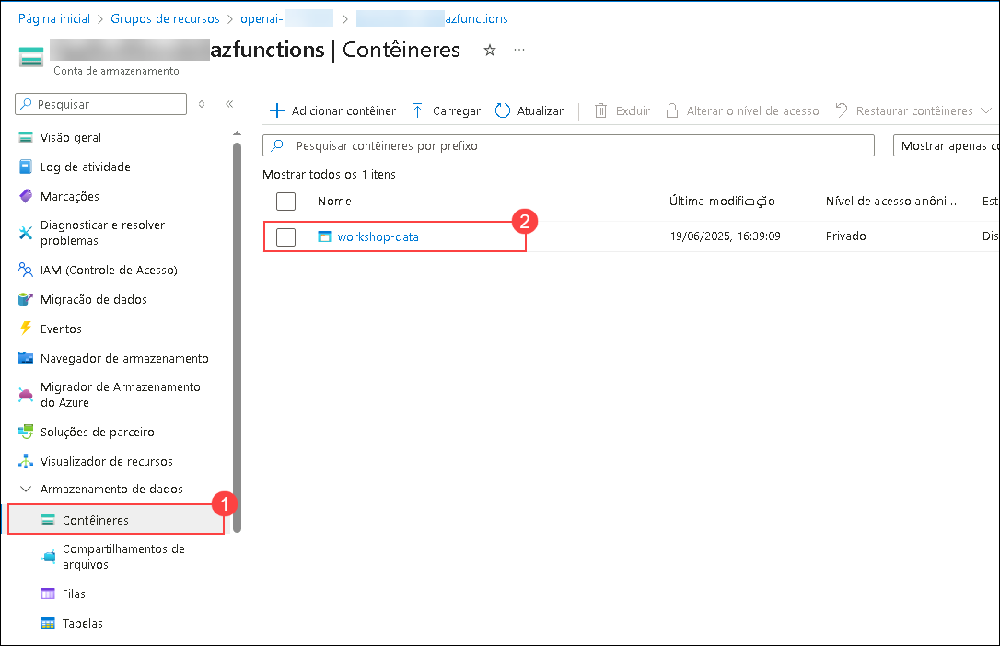

# Exercício 1: Construir um Pipeline de IA Aberto para Ingerir Dados em Lote, Executar Operações Inteligentes e Analisar no Synapse

### Duração Estimada: 120 minutos

Este laboratório tem como objetivo demonstrar como integrar os recursos do OpenAI ao Azure Synapse Analytics para processar dados em lote, executar operações inteligentes como processamento de linguagem natural ou análise preditiva e analisar os resultados de forma eficiente no ambiente Synapse.

## Objetivos do Laboratório

Você poderá concluir as seguintes tarefas:

- Tarefa 1: Ingerir dados na conta de armazenamento
- Tarefa 2: Configurar o Synapse Workspace
- Tarefa 3: Consultar os resultados em nossa tabela SQL

## Tarefa 1: Ingerir dados na conta de armazenamento

### A. Lançar o Azure Cloud Shell

1. No [Portal de Azure](https://portal.azure.com?azure-portal=true), selecione o botão **[>_]** (*Cloud Shell*) que se encontra no topo da página a direita da pesquisa. O painel do Cloud Shell irá abrir na parte inferior do portal.

   

2. Na primeira vez que abrir o Cloud Shell, pode ser solicitado que escolha o tipo de shell que deseja usar (*Bash* ou *PowerShell*). Selecione **Bash**. Se esta opção não abrir pode avançar para o próximo passo.

   .png)

3. No painel Getting Started, selecione **Montar conta de armazenamento (1)**, selecione **Assinatura de conta de armazenamento (2)** na lista de opções e selecione **Aplicar (3)**.

   .png)

4. No painel **Montar conta de armazenamento**, selecione **Selecione uma conta de armazenamento existente (1)** e clique **Avancar (2)**.

   .png)

5. No painel **Configurações avançadas**, introduza os seguintes detalhes:

    - **Subscrição**: Default- Escolha a única assinatura existente atribuída para este laboratório. **(1)**.
    - **Grupo de recursos**: Selecione **Usar existente** **(2)**
      - openai-<inject key="DeploymentID" enableCopy="false"></inject>
    - **Nome da conta de armazenamento**: Selecione **Usar existente** **(3)**
      - openaistorage<inject key="DeploymentID" enableCopy="false"></inject>
    - **Compartilhamento de arquivos**: Criar um novo compartilhamento de arquivo **(4)**

      -2.png)

1. Introduzir o nome do compartilhamento de arquivos **(Novo) blob (1)**, e selecione **Selecionar (2)**.

    -2.png)

1.  Depois que a conta de armazenamento for criada, você verá a janela do Bash, conforme mostrado na captura de tela abaixo.
    
    

    > **Observação**: desconsidere o aviso `o ID de assinatura do compartilhamento de arquivo de armazenamento não está registrado no Microsoft.CloudShell Namespace` e prossiga com a próxima tarefa.

### B. Carregar arquivos para a storage account:

1. Execute os seguintes comandos no Cloud Shell para fazer download e instalar o Miniconda. 

     ```bash 
     wget https://repo.anaconda.com/miniconda/Miniconda3-py39_23.1.0-1-Linux-x86_64.sh 
     ```

     ```bash 
     sh Miniconda3-py39_23.1.0-1-Linux-x86_64.sh 
     ```
    
    > **Nota:** Os seguintes comandos são executados em Bash; certifique-se de que está a usar **Bash** na Cloud Shell.
    
    > **Nota:** Pressione a tecla de seta para baixo para ler ou ignorar o acordo de licença.

1. Pressione `Enter` para continuar o processo de instalação.

    >**Nota:** Pressione a tecla de seta para baixo para ler ou pular o contrato de licença.

    

1. Digite **yes** e pressione **enter** para aceitar o acordo, e pressione enter para instalar na pasta padrão.

   

1. Digite **yes** e pressione **enter** para inicializar o ambiente conda.

    

    > **Observação:** Após a instalação do ambiente conda, você poderá ver a mensagem de saída como esta.
    > 

1. Execute os comandos abaixo um por um para criar e ativar o ambiente conda no CloudShell.

    ```bash 
    git clone https://github.com/CloudLabsAI-Azure/openaifilesworkshop.git
    ```

    ```bash
    cd openaifilesworkshop/scenarios/openai_batch_pipeline/document_generation
    ```

    ```bash
    conda create -n document-creation
    ```

    ```bash
    conda activate document-creation
    ```

    > **Nota:** Se você encontrar o erro **"Conda: command not found"** após executar este comando, feche sua sessão atual do CloudShell, inicie uma nova sessão Bash e tente executar novamente os comandos deste **Passo 6**.

    ```bash
    pip install --upgrade pip
    pip install -r reqs.txt
    ```

    > **Nota:** Se você encontrar erros ao executar os comandos pip acima, execute os comandos abaixo:
    >
    >     pip install --user --upgrade pip
    >     pip install --user -r reqs.txt
    
1. Digite **y** e pressione enter para prosseguir.
   > **Nota:** Prossiga para o próximo passo se não for solicitado para isso.

1. No [Portal do Azure](https://portal.azure.com), navegue para a Conta de Armazenamento com o sufixo `azfunctions` selecionando o **openai-<inject key="DeploymentID" enableCopy="false"/>** grupo de recursos e selecione a conta de armazenamento da lista de recursos.

    
    
1. Mude para a janela **Chaves de acesso (1)** e selecione **Mostrar (2)**, que está ao lado do valor da Connection String. Selecione o botão de copiar para a primeira **Cadeia de conexão (3)**. Cole o valor em um editor de texto, como o Notepad.exe, para referência futura."

   

1. Volte para a sessão Bash do Cloud Shell e execute o comando abaixo para fazer o upload dos arquivos JSON para uma conta de armazenamento, atualizando a <CONNECTION_STRING> copiada na etapa anterior. Este passo levará alguns minutos para ser concluído.

    ```bash 
    python upload_docs.py --conn_string "<CONNECTION_STRING>"
    ```

   

   > **Observação**: Certifique-se de estar no diretório **openaifilesworkshop/scenarios/openai_batch_pipeline/document_generation** antes de executar o comando. Se você ainda não estiver neste diretório, use o seguinte comando para navegar até ele:
   >```bash
   >cd openaifilesworkshop/scenarios/openai_batch_pipeline/document_generation
   >```   
   > Quando estiver no diretório correto, você pode executar o comando necessário.

1. Depois de carregar com sucesso os arquivos JSON na conta de armazenamento, navegue até **Contêineres (1)**, clique em **workshop-data (2)**, selecione a pasta **cleansed_documents (3)** e verifique se os arquivos foram carregados.

   

   

> **Parabéns** pela conclusão da tarefa! Agora é hora de validá-la. Aqui estão os passos:
> - Se receber uma mensagem de sucesso, você pode prosseguir para a próxima tarefa.
> - Caso contrário, leia atentamente a mensagem de erro e repita o passo, seguindo as instruções do guia do laboratório.
> - Se precisar de ajuda, entre em contato conosco pelo e-mail cloudlabs-support@spektrasystems.com. Estamos disponíveis 24 horas por dia, 7 dias por semana, para ajudar.   

<validation step="ef9a8088-8af2-426f-9672-70c0b0c227b5" />

## Tarefa 2: Configurar o Synapse Workspace

### **A. Configurar o Synapse Workspace**

1. No portal do Azure, procure **Synapse** e selecione **Azure Synapse Analytics**.

   

1. Na página **Azure Synapse Analytics**, clique em **+ Criar**.
1. Você será direcionado para a página **Criar Synapse Analytics**, onde configurará o espaço de trabalho do synapse.
1. Na guia Básico forneça os seguintes detalhes:

   - **Assinatura**: Use **Assinatura Existente(1)**.
   - **Grupo de recursos**: use **openai-<inject key="DeploymentID" enableCopy="false"></inject>(2)**
   - **Nome do espaço de trabalho**: **synapseworkspace<inject key="DeploymentID" enableCopy="false"></inject>(3)**
   - **Região**: Selecione a região padrão(4)
   - **Selecione Data Lake Storage Gen2**: Selecione **Da assinatura(5)**
   - **Nome da conta**: **asadatalake<inject key="DeploymentID" enableCopy="false"></inject>(6)**
   - **Nome do sistema de arquivos** : **defaultfs(7)**
   - Clique em **Próximo: Segurança>(8)**
  
     -1.png)

1. Na guia **Segurança**, certifique-se de que o método de autenticação esteja definido como **Usar a autenticação local e a autenticação do Microsoft Entra ID (1)** e clique em **Próximo: Rede (2)**

   -1.png)

1. Na guia rede, certifique-se de que a rede virtual gerenciada esteja **Desabilitar (1)** e **Permitir conexões de todos os endereços IP (2)** esteja marcada e clique em **Examinar + Criar (3)** e *Criar* para implantar o recurso.

   -1.png)

   > **Nota:** A implantação pode levar aproximadamente 5 minutos para ser concluída.

1. Depois que o recurso for implantado, clique em **Ir para o grupo de recursos**

    -1.png)

1. Navegue até o espaço de trabalho do Synapse que você criou, na página **Visão geral (1)**, clique em **Abrir (2)** em Abrir Synapse Studio para navegar até o Azure Synapse Studio.

   

1. No Azure Synapse Studio, navegue até **Manage (1) > SQL pools (2)** e clique em **+Novo (3)**

      

1. Na aba "Básico" do novo pool de SQL dedicado, forneça os seguintes detalhes:

      - **Nome do pool de SQL dedicado: openaisql01** **(1)**
      
      - **Nível de desempenho:** Reduza para **DW100c** **(2)**
      
      - Clique em **"Examinar e Criar"** **(3)**

        

1. Na página **Revisar + criar**, clique em **Criar** e aguarde a conclusão da implantação.

      

   > **Nota:** A implantação pode levar aproximadamente 10 minutos para ser concluída.

1. Agora navegue de volta ao portal do Azure, **synapseworkspace<inject key="DeploymentID" enableCopy="false"></inject>**, selecione **Apache Spark pools (1)** no painel esquerdo em Analytics pools e clique em **+ Novo (2).**

    .png)

1. Na página Novo pool do Apache Spark, forneça os seguintes detalhes e clique em **Revisar + criar (6)**, depois clique na guia **Criar** para criar o pool do Apache Spark.

   - **Nome do pool do Apache Spark**: **openaisparkpool (1)**

   - **Computação Isolada**: **Desativado (2)**
   
   - **Tamanho do nó**: **Pequeno (4 vCores/32 GB) (3)**
   
   - **Escalonamento Automático**: **Desativado (4)**
   
   - **Número de nós**: **3 (5)**
   
      -1.png)

### **B. Criar tabela SQL de destino**

1. No [Portal de Azure](https://portal.azure.com), navegue até ao synapse workspace **synapseworkspace<inject key="DeploymentID" enableCopy="false"/>** no resource group **openai-<inject key="DeploymentID" enableCopy="false"/>**. Na aba **Visão geral (1)**, clique em **Abrir (2)** para iniciar o Synapse workspace.

      

1. Clique na seção **Develop (1)** no Synapse Studio, clique em **+ (2)** faça login no topo esquerdo e selecione **SQL script (3)**. Isso abrirá uma nova janela com um editor de script SQL.

      

1. Copie e cole o seguinte script no editor **(1)**, em seguida, altere o valor **Conectar-se com** selecionando **openaisql01(2)** a partir da lista suspensa, e para **Usar banco de dados**, confirme que **openaisql01(3)** está selecionado, e clique no botão **Executar (4)** no canto superior esquerdo, como mostra a imagem abaixo. Conclua esta etapa pressionando **Publicar tudo (5)** logo acima do botão **Correr** para publicar nosso trabalho até agora.

    ```SQL 
    CREATE TABLE [dbo].[cs_detail]
    (
    interaction_summary varchar(8000),
    sentiment varchar(500),
    topic varchar(500),
    product varchar(500),
    filename varchar(500)
    )
    ```
    
    
    
1. Em seguida, clique em **Publicar** para publicar o script SQL.

      

### **C. Criar a Origem e Destino em Linked Services**

Em seguida, precisaremos criar dois linked services: um para nossa origem (os arquivos JSON no Data Lake) e outro para o Banco de Dados SQL Synapse que contem a tabela que criamos na etapa anterior.

1. Clique novamente na seção **Manage (1)** do Synapse Studio e clique na opção **Linked services (2)** na seção **External connections**. Em seguida, clique em **+ Novo (3)** no canto superior esquerdo.

      
   
1. Somece criando os linked services para a nossa fonte de dados, usando os arquivos JSON alojados no armazenamento ADLS Gen2 que criamos com nosso modelo inicial. Na barra de pesquisa que é aberta depois de clicar em Novo, procure **blob (1)**, selecione **Armazenamento de Blobs do Azure (2)** conforme descrito abaixo e clique em **Continuar (3)**.

      

1. Forneça o nome do seu serviço vinculado como **openailinkedservice (1)**. Altere o **Tipo de Autenticação** para **Chave de Conta (2)**. Em seguida, selecione a **assinatura (3)** com a qual você está trabalhando e, por fim, selecione a conta de armazenamento com **funções (4)** como sufixo que você criou no modelo inicial e carregou os arquivos JSON para ela. Em seguida, clique em **Testar Conexão (5)**. Após a conexão ser bem-sucedida, clique no botão azul **Criar (6)** no canto inferior esquerdo da janela Novo Serviço Vinculado.

      

1. Clique em **+ Novo** no canto superior esquerdo. Procure **Synapse (1)**, selecione **Azure Synapse Analytics (2)**, e clique em **Continuar (3)**.

      

1. Na janela *New linked service* que se abre, preencha um nome para o target linked service como **synapselinkedservice(1)** **Versao: 1.0(2)**. Selecione a **Assinatura do Azure (3)**  na qual você tem trabalhado. Selecione **synapseworkspace<inject key="DeploymentID" enableCopy="false"/> (4)** para **Nome do servidor** e **openaisql01 (5)** como o **Nome do banco de dados**. Certifique-se de alterar o **Tipo de autenticação** para **Identidade gerenciada atribuída pelo sistema (6)**, depois clique em **Testar conexão (7)** e clique em **Criar (8)**.

      

      

1. Depois de criar os dois linked services, certifique-se de pressionar o botão **Publicar tudo** na parte superior para publicar o nosso trabalho. Finalize a criação dos linked services e clique em **Publicar**.

      
   
### **D. Criar fluxo de dados Synapse**

Ainda dentro do Synapse Studio, agora precisaremos criar um **Fluxo de dados** para inserir os nossos dados JSON e gravá-los em nosso banco de dados SQL. Para este workshop, este será um fluxo de dados muito simples que insere os dados, renomeia algumas colunas e os grava de volta na tabela de destino.

1. Primeiro, vamos querer voltar para o separador **Develop (1)**, selecionar **+ (2)**, e depois **Fluxo de dados (3)**.

      
   
1. Quando o editor de fluxo de dados abrir, clique em **Adicionar fonte**. Uma nova janela será aberta na parte inferior da tela. Selecione **+ Novo** na linha **Conjunto de Dados** deixando as outras opções como padrão.

      

1. Uma nova janela deve ser aberta no lado direito da tela. Em seguida, procure por **Armazenamento de Blobs do Azure (1)**, selecione **Armazenamento de Blobs do Azure (2)**, e clique em **Continuar (3)**.
   
      

1. Em seguida, selecione a opção **JSON (1)** pois os nossos dados de entrada estão no formato JSON e clique em **Continuar (2)**.

      

1. Selecione o Linked Service com o nome **openailinkedservice (1)** que acabamos de configurar nas etapas acima. Você precisará selecionar a **Caminho do arquivo** para escolher o diretório onde nossos arquivos JSON estão armazenados. Deve ser algo semelhante a **workshop-data / cleansed_documents (2)**. Clique no botão **OK (3)** para fechar a janela.

      
   
1. Em seguida, precisaremos ir para o painel **Opções de origem (1)** e listar as opções **Configurações JSON (2)**. Precisamos alterar a opção **Document form** para a configuração **Array of documents (3)**. Isso permite que nosso fluxo leia cada arquivo JSON como uma entrada separada em nosso banco de dados.

         

1. Ativar a opção **Depuração de fluxo de dados** localizada na barra de menu superior adjacente ao botão validar e clique em **OK** na janela pop-up *Turn on data flow debug*.

      >**Nota:** Levará um ou dois minutos para que a sessão **Depuração de fluxo de dados** seja ativada.

1. Navegue até ao separador **Pré-visualização de dados** e execute uma visualização para verificar seu trabalho até agora.
    
      

      >**Nota**: Se não conseguir visualizar os dados no separador Data Preview, clique no botão Atualizar até os dados aparecerem.
   
1. Em seguida, podemos adicionar no nosso bloco **Selecione** e fazer nossas pequenas alterações antes de gravar os dados na tabela Synapse SQL. Para começar, clique no pequeno sinal **+ (1)** ao lado do nosso bloco de ingestão e escolha a opção **Selecione (2)**.

      

1. Podemos deixar todas as configurações como padrão. Em seguida, adicionaremos nosso bloco **Afundar**. sta é a etapa que gravará nossos dados em nosso banco de dados Synapse SQL. Clique no pequeno sinal **+ (1)** o lado do nosso bloco **Selecione**. até a parte inferior do menu de opções e selecione a opção **Afundar (2)**.

      

1. Quando o bloco **Coletor (1)** abrir, escolha **Embutido (2)** para o *Sink type*. Em seguida, selecione **Azure Synapse Analytics (3)** para o *Inline dataset type*, e para o **Serviço vinculado**, selecione **Synapselinkedservice (4)**, que foi criado na etapa anterior. Certifique-se de executar **Testar conexão (5)** para o linked service.

      

      > **Nota**: Se a conexão de teste demorar mais de 3 a 4 minutos, siga as etapas abaixo.

      - Clique em **Edit**.

               

      - Na janela Editar linked service que é aberta, selecione o método de seleção do Azure como **From Azure subscription** **(1)**. Selecione a **Assinatura do Azure (2)** para a qual você tem trabalhado. Selecione **asaworkspace<inject key="DeploymentID" enableCopy="false"/> (3)** para **Nome do servidor** e **openaisql (4)** como o **Nome do banco de dados**, clique em **Testar conexão (5)** e clique em **Salvar (6)**.

           

           

1. Em seguida, precisaremos ir para o separador **Configurações (1)** e ajustar o **Nome do esquema** e **Nome da tabela**. Se você utilizou o script fornecido anteriormente para criar a tabela de destino, o nome do esquema é **dbo (2)** e o nome da tabela é **cs_detail (3)**.

      

1. Antes de terminarmos nosso trabalho sobre o data flow, devemos visualizar nossos dados. A pré-visualização dos nossos dados revela que só temos 3 colunas quando esperamos um total de 5. Perdemos as nossas colunas Summary e Sentiment.

      

1. Para corrigir isso, vamos usar nosso bloco **Select (1)** para alterar os nomes da seguinte forma para obter os valores de saída esperados:

     - **Summary**: `interaction_summary` **(2)**
     - **CustomerSentiment**: `sentiment` **(3)**

          
    
1. Retornando ao bloco **Sink (1)** por baixo de **Pré-visualização de dados (2)** clique **Atualizar (3)**, vamos agora ver as 5 colunas que são esperadas.

      

1. Depois de revisar os dados e estar satisfeito que todas as colunas foram mapeadas com êxito (você deve ter 5 colunas no total, todas mostrando dados em um formato tipo string), podemos selecionar **Publish all** na parte superior para salvar nossa configuração atual. Uma janela será aberta no lado direito da tela; pressione o botão azul **Publish** na parte inferior esquerda para salvar suas alterações.

      

1. O seu Data flow concluído e salvo terá a seguinte aparência:

      

### **E. Criar um Pipeline em Synapse**

1. Depois de criarmos o nosso **Data flow**, precisaremos configurar um **Pipeline** para alojar o Data Flow. Para criar um **Pipeline**,  navegue até a barra de menu à esquerda e escolha a opção **Integrate (1)**. Em seguida, clique no botão **+ (2)** a parte superior do menu Integrate para **Adicionar um novo recurso** e escolha **Pipeline (3)**.

      

2. Em seguida, precisamos adicionar um **Fluxo de dados** ao nosso Pipeline. Com o novo separador **Pipeline tab (1)** aberto, vá para a seção **Atividades** e procure por `data` **(2)** e selecione a atividade **Fluxo de dados (3)** e **arrastar e soltar (4)** no seu Pipeline.

      

3. No separador **Configurações (1)** do **Fluxo de dados**, selecione o menu **Fluxo de dados (2)** e selecione o nome do fluxo de dados criado na etapa anterior. Em seguida, expanda a seção **Encenação (3)** na parte inferior das configurações e utilize o menu suspenso para o **Serviço vinculado de preparação**. Escolha o linked service que você criou **openailinkedservice (4)** para garantir a **Testar conexão (5)**. Em seguida, defina uma **Pasta de armazenamento de preparação** na parte inferior e digite **workshop-data/Staging** **(6)**.

      

4. Em seguida, clique em **Publicar tudo** para publicar as alterações efetuadas e salvar o seu progresso.

### **F. Executar um Pipeline em Synapse**

1. Depois de publicar com sucesso o seu trabalho, precisamos iniciar o nosso pipeline. Para fazer isso, logo abaixo dos separadores na parte superior do Studio, há um ícone de *raio* que diz **Adicionar gatilho (1)**. Clique para adicionar um trigger e selecione **Disparar agora (2)** para iniciar uma execução de pipeline e, quando a janela abrir, clique em **OK**.

      
    
2. Para ver a execução do pipeline, navegue até o lado esquerdo da tela e escolha a opção **Monitor (1)**. Em seguida, selecione a opção **Pipeline runs (2)** na seção **Integration**. Em seguida, você verá a execução do pipeline que você acionou na seção **Triggered (3)** como **pipeline 1 (4)**.  Este pipeline deve levar aproximadamente 4 minutos (se você estiver usando os dados carregados para o workshop).

      

> **Parabéns** pela conclusão da tarefa! Agora é hora de validá-la. Aqui estão os passos:
> - Se receber uma mensagem de sucesso, você pode prosseguir para a próxima tarefa.
> - Caso contrário, leia atentamente a mensagem de erro e repita o passo, seguindo as instruções do guia do laboratório.
> - Se precisar de ajuda, entre em contato conosco pelo e-mail cloudlabs-support@spektrasystems.com. Estamos disponíveis 24 horas por dia, 7 dias por semana, para ajudar.

<validation step="3e716f01-6da8-431e-aa81-4041b9054091" />    

## Tarefa 3: Resultados da consulta em nossa tabela SQL

1. Certifique-se de que o status de execução do pipeline tenha **Bem-sucedido**.

      

2. Agora que os dados estão na tabela de destino, eles estão disponíveis para uso executando consultas SQL ou conectando o PowerBI e criando visualizações. Faça upload de alguns dos arquivos de transcrição para a pasta generate_documents em seu contêiner e veja como ele cria um novo arquivo no arquivo Cleaned_documents.

3. Para consultar os novos dados, navegue até o menu do lado esquerdo e escolha **Develop (1)**. Clique no **SQL Script (2)** existente e substitua o conteúdo pelo **SQL Code (3)** abaixo. Em seguida, selecione **openaisql (4)** pool **Run (5)**. 

     ```SQL 
     SELECT sentiment, count(*) as "Sum of Sentiment"
     FROM [dbo].[cs_detail]
     GROUP BY sentiment
     ORDER BY count(*) desc     
     ```
     
   - Os resultados da sua consulta, se você estiver usando os arquivos carregados como parte deste repositório ou do workshop, você verá **Results (6)** semelhantes aos abaixo.

        

## Resumo

Neste laboratório, você ingeriu dados para a conta de armazenamento, configurou o Synapse Workspace e produziu resultados de consulta em nossa tabela SQL.

### Você concluiu o laboratório com sucesso. Clique em **Avançar >>** para prosseguir para o próximo exercício.
