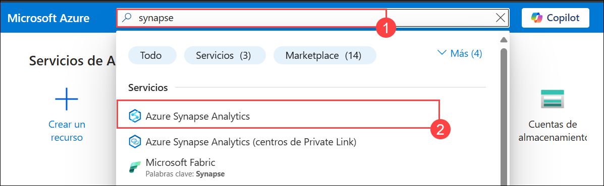
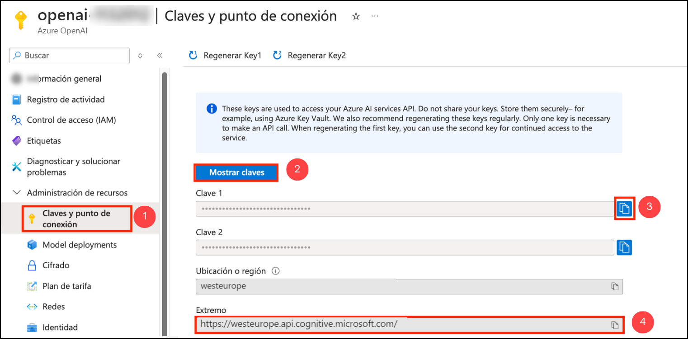

# Ejercicio 3: Desarrollar una aplicación de IA abierta con Python

### Duración estimada: 90 minutos

En este laboratorio, los participantes desarrollarán una aplicación utilizando las API de OpenAI y el lenguaje de programación Python. El objetivo es demostrar cómo implementar funcionalidades de IA como la generación de lenguaje, el análisis de sentimientos o los sistemas de recomendación con Python, aprovechando los potentes modelos y herramientas de OpenAI.

1. Busque y seleccione **Azure Synapse Analytics** en el Portal de Azure.

      

1. En la ventana **Azure Synapse Analytics** seleccione **asaworkspace<inject key="DeploymentID" enableCopy="false"/>**.   

1. En la hoja **Información general** de la sección **Introducción**, haga clic en **Abrir** para abrir Synapse Studio.
     
     .png)
    
1. Haga clic en **Desarrollar (1)**, luego haga clic en **+ (2)** y seleccione **Importar**.

    

1. Navegue a la ubicación `C:\labfile\OpenAIWorkshop-main\scenarios\powerapp_and_python\python` y seleccione `OpenAI_notebook.ipynb`, luego haga clic en **Abrir**.

     

1. Seleccione **openaisparkpool** del menú desplegable **Adjuntar a**.

    

1. Haz clic en el botón **▷ Run** junto a cada celda, paso a paso, en el orden que se menciona a continuación.

1. En **1. Install OpenAI**, haz clic en el botón **Run** junto a la primera celda.

    

    > **Nota:** Si la celda **Install OpenAI** tarda más de lo esperado y sigue en bucle, haz clic en **Stop session**. Espera hasta que los **Apache Spark pools** cambien al estado **Stopped**. Es posible que necesites reiniciar el kernel para usar los paquetes actualizados.
      

1. En **2. Import helper libraries and instantiate credentials**, reemplaza **AZURE_OPENAI_API_KEY** y **AZURE_OPENAI_ENDPOINT** con tu clave de API y la URL de tu endpoint. Luego, ejecuta esta celda después de actualizar los valores requeridos.

     
   
1. Desde el Portal de Azure, navegue hasta el grupo de recursos  **openaicustom-<inject key="DeploymentID" enableCopy="false"/>** y seleccione el recurso Azure OpenAI **asaworkspace<inject key="DeploymentID" enableCopy="false"/>**.

    

1. En Administración de Recursos, seleccione **Claves y punto de conexión (1)** y haga clic en **Mostrar claves (2)**. Copie la **Clave 1 (3)** y el **Punto de conexión (4)** y reemplace **AZURE_OPENAI_API_KEY** y **AZURE_OPENAI_ENDPOINT** con su clave de API y la URL del punto de conexión en el script.

   
     
    > **Nota:** Si aparece el error "No se encontró el módulo OpenAI", siga estos pasos:

    -  Agregue * junto a 0.* para iniciar la instalación del último módulo OpenAI.

    - Ejecute la celda "Instalar OpenAI". Una vez que se complete la instalación, vuelva a ejecutar el portátil.

      

1. Para **2. Choose a Model**, reemplaza el valor de **model** de **text-curie-001** a **demomodel** y **ejecuta** esta celda.

    

1. Para la celda en **temperature**, reemplaza el valor de **engine** de **text-curie-001** a **demomodel**, y ejecuta esta celda.

     

1. Para la celda en **top_p**, reemplaza el valor de **engine** de **text-curie-001** a **demomodel**, y ejecuta esta celda.

     

1. Para la celda en **n**, reemplaza el valor de **engine** de **text-curie-001** a **demomodel**, y ejecuta esta celda.

     

1. Para la celda en **logprobs**, reemplaza el valor de **engine** de **text-curie-001** a **demomodel**, y ejecuta esta celda.

     

1. Después de ejecutar correctamente las celdas del Notebook, haz clic en **Publish all**.

     

1. Luego haga clic en **Publicar** para guardar los cambios. 

    

> **¡Felicitaciones!** por completar la tarea. Ahora es momento de validarla. Estos son los pasos:
> - Si recibe un mensaje de éxito, puede continuar con la siguiente tarea.
> - De lo contrario, lea atentamente el mensaje de error y vuelva a intentar el paso siguiendo las instrucciones de la guía del laboratorio.
> - Si necesita ayuda, contáctenos en cloudlabs-support@spektrasystems.com. Estamos disponibles 24/7 para ayudarle.
  
<validation step="f943c5b3-b07a-4779-bc2f-9e13ee01378a" />

## Resumen

En este laboratorio, desarrollarás con éxito una aplicación implementando funcionalidades de IA como generación de lenguaje, análisis de sentimientos o sistemas de recomendación con Python, aprovechando los potentes modelos y herramientas de OpenAI.

### Ha completado con éxito la práctica de laboratorio. Haga clic en **Siguiente >>** para continuar con el siguiente ejercicio.
