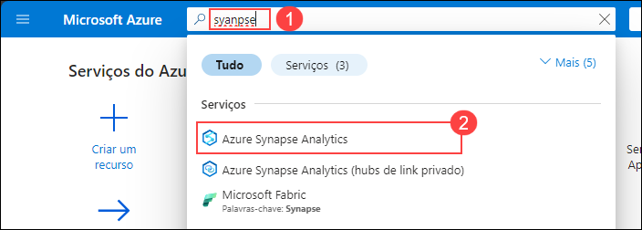
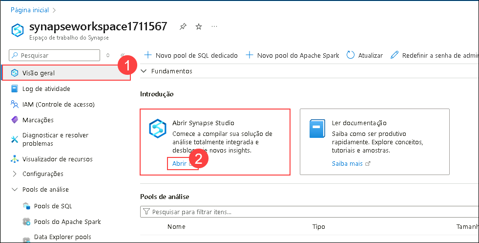
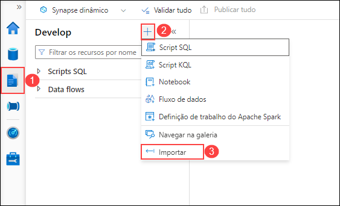
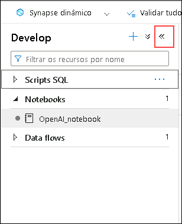
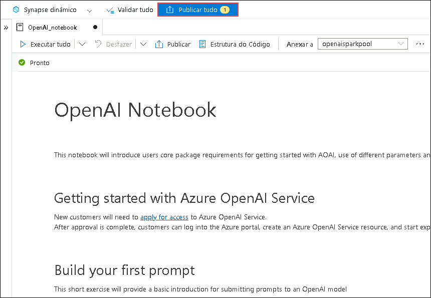
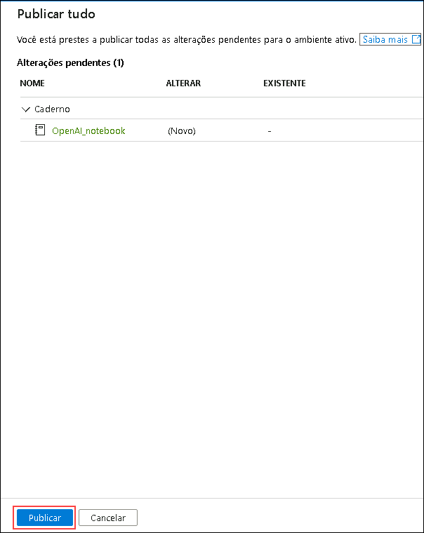

# Exercise 3: Build an Open AI application with Python

### Duração estimada: 90 minutos

Neste laboratório, os participantes desenvolverão uma aplicação utilizando as APIs da OpenAI e a linguagem de programação Python. O objetivo é demonstrar como implementar funcionalidades de IA, como geração de linguagem, análise de sentimentos ou sistemas de recomendação, utilizando Python, aproveitando os poderosos modelos e ferramentas da OpenAI.

1. Retorne ao **Portal do Azure**. Pesquise **Azure Synapse Analytics (1)** e selecione **Azure Synapse Analytics (2)** no portal do Azure.

      

1. Na janela **Azure Synapse Analytics** selecione **synapseworkspace<inject key="DeploymentID" enableCopy="false"/>**.   

1. Na lâmina **Visão geral (1)** na seção **Introdução**, clique em **Abrir (2)** para abrir o Synapse Studio.
     
     
    
1. Clique em **Desenvolver (1)**, depois clique em **+ (2)** e selecione **Importar (3)**.

    

1. Navegue até o local `C:\labfile\OpenAIWorkshop-main\scenarios\powerapp_and_python\python` e selecione `OpenAI_notebook.ipynb` e clique em **Abrir**.

     

1. Clique no ícone **Recolher** para maximizar a tela.

     

1. Selecione **openaisparkpool** no menu suspenso de **Anexar a**.

    

1. Execute o notebook passo a passo para concluir este exercício. Clique no botão **Run** ao lado da célula.

     

1. Em **1. Install OpenAI**, clique no botão **Executar** ao lado das primeiras células e clique em **parar sessão**. Aguarde até que os **pools Apache Spark** passem para o estado de parada. 

     

      > **Note**: Pode ser necessário reiniciar o kernel para usar os pacotes atualizados

1. Em **2. Import helper libraries and instantiate credentials** e substitua **AZURE_OPENAI_API_KEY** e **AZURE_OPENAI_ENDPOINT** pela sua chave de API e URL do endpoint.

     
   
1. No Portal do Azure, navegue até o grupo de recursos **openaicustom-<inject key="DeploymentID" enableCopy="false"/>** e selecione o recurso **openai-<inject key="DeploymentID" enableCopy="false"/>** do Azure OpenAI.

    .png)

1. Em Gerenciamento de Recursos, selecione **Chaves e Ponto de extremidade (1)** e clique em **Mostrar as Chaves (2)**. Copie **Chave 1 (3)** e **Ponto de extremidade (4)** e substitua **AZURE_OPENAI_API_KEY** e **AZURE_OPENAI_ENDPOINT** pela sua chave de API e URL do Endpoint no script.

   .png)
     

     > **Nota:** Se você encontrar o erro "Módulo OpenAI não encontrado", siga estas etapas:

      - Adicione * ao lado de 0.* para iniciar a instalação do módulo OpenAI mais recente.

      - Execute a célula "Instalar OpenAI". Após a conclusão da instalação, execute o notebook novamente.

           

1. Para **2. Choose a Model** e substitua o valor do **model** de **text-curie-001** para **demomodel**.

    

1. Em **temperature**, substitua o valor **motor** de **text-curie-001** para **demomodel**.

     

1. Em **top_p**, substitua o valor **engine** de **text-curie-001** para **demomodel**.

     

1. Para **n**, substitua o valor **engine** de **text-curie-001** para **demomodel**.

     

1. Em **logprobs**, substitua o valor **engine** de **text-curie-001** para **demomodel**.

     

1. Depois de executar o notebook com sucesso, clique em **Publicar tudo**.

     

1. Em seguida, clique em **Publicar** para salvar as alterações.

    

> **Parabéns** pela conclusão da tarefa! Agora é hora de validá-la. Aqui estão os passos:
> - Se receber uma mensagem de sucesso, você pode prosseguir para a próxima tarefa.
> - Caso contrário, leia atentamente a mensagem de erro e repita o passo, seguindo as instruções do guia do laboratório.
> - Se precisar de ajuda, entre em contato conosco pelo e-mail Cloudlabs-support@spektrasystems.com. Estamos disponíveis 24 horas por dia, 7 dias por semana, para ajudar.

<validation step="f943c5b3-b07a-4779-bc2f-9e13ee01378a" />

## Resumo

Neste laboratório, você desenvolveu com sucesso uma aplicação implementando funcionalidades de IA, como geração de linguagem, análise de sentimentos ou sistemas de recomendação usando Python, aproveitando os poderosos modelos e ferramentas do OpenAI.

### Você concluiu o laboratório com sucesso. Clique em **Avançar >>** para prosseguir para o próximo exercício.