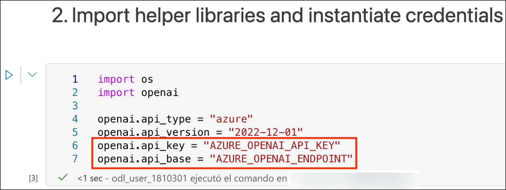

# Ejercicio 3: Desarrollar una aplicación de OpenAI con Python

### Duración estimada: 90 minutos

En este Ejercicio, los participantes desarrollarán una aplicación utilizando las APIs de OpenAI y el lenguaje de programación Python. El objetivo es demostrar cómo implementar funcionalidades de IA como la generación de lenguaje, el análisis de sentimientos o los sistemas de recomendación con Python, aprovechando los potentes modelos y herramientas de OpenAI.

1. Regrese al **Portal de Azure**, busque **Azure Synapse Analytics (1)** y **selecciónelo en (2)** los resultados.

      

1. En la ventana **Azure Synapse Analytics** seleccione **synapseworkspace<inject key="DeploymentID" enableCopy="false"/>**.   

1. En la hoja **Información general (1)** del espacio de trabajo de Synapse que creó, haga clic en **Abrir (2)** en **Abrir Synapse Studio** para abrir Azure Synapse Studio.
     
     
    
1. En Synapse Studio, haga clic en **Develop (1)**, luego haga clic en **+ (2)** y seleccione **Importar (3)**.

    

1. Navegue a la ubicación `C:\labfile\OpenAIWorkshop-main\scenarios\powerapp_and_python\python` **(1)** y seleccione `OpenAI_notebook.ipynb` **(2)**, luego haga clic en **Abrir (3)**.

     

1. Haga clic en el icono **Contraer** para maximizar el espacio de trabajo.

    

1. En el menú desplegable **Asociar a**, seleccione **openaisparkpool**.

    

1. Ejecute cada celda del cuaderno secuencialmente haciendo clic en el botón **Run (▷)** junto a cada una, siguiendo los pasos a continuación.

1. En **1. Install OpenAI**, haga clic en el botón **Run** junto a la primera celda.

    

    > **Nota:** Si la celda **Install OpenAI** tarda más de lo esperado y sigue en bucle, haga clic en **Stop session**. Espere hasta que los **Apache Spark pools** cambien al estado **Stopped**. Es posible que necesite reiniciar el kernel para usar los paquetes actualizados.

      

1. En **2. Import helper libraries and instantiate credentials**, reemplace **AZURE_OPENAI_API_KEY** y **AZURE_OPENAI_ENDPOINT** con su clave de API y la URL de su extremo. Luego, ejecute esta celda después de actualizar los valores requeridos.

     

1. Desde el Portal de Azure, navegue hasta el grupo de recursos  **openaicustom-<inject key="DeploymentID" enableCopy="false"/> (1)** y seleccione el recurso Azure OpenAI **openai<inject key="DeploymentID" enableCopy="false"/> (2)**.

    

1. En Administración de Recursos, seleccione **Claves y punto de conexión (1)** y haga clic en **Mostrar claves (2)**. Copie la **Clave 1 (3)** y el **Extremo (4)** y reemplace **AZURE_OPENAI_API_KEY** y **AZURE_OPENAI_ENDPOINT** con su clave de API y la URL del punto de conexión en el script.

   
     
    > **Nota:** Si aparece el error "OpenAI module not found", siga estos pasos:

    - Agregue un asterisco (`*`) junto a `0.` para iniciar la instalación del módulo OpenAI más reciente.

    - Ejecute la celda "Install OpenAI". Una vez que se complete la instalación, vuelva a ejecutar el cuaderno.

     

1. Para **2. Choose a Model**, reemplace el valor de **model** de **text-curie-001** a **demomodel** y **ejecute** esta celda.

    

1. Para la celda **temperature**, reemplace el valor de **engine** de **text-curie-001** a **demomodel**, y ejecute esta celda.

     

1. Para la celda **top_p**, reemplace el valor de **engine** de **text-curie-001** a **demomodel**, y ejecute esta celda.

     

1. Para la celda **n**, reemplace el valor de **engine** de **text-curie-001** a **demomodel**, y ejecute esta celda.

     

1. Para la celda **logprobs**, reemplace el valor de **engine** de **text-curie-001** a **demomodel**, y ejecute esta celda.

     

1. Después de ejecutar correctamente las celdas del cuaderno, haga clic en **Publicar todo**.

     

1. Luego haga clic en **Publicar** para guardar los cambios. 

    

> **¡Felicitaciones** por completar la tarea!. Ahora es momento de validarla. Estos son los pasos:
> - Si recibe un mensaje de éxito, puede continuar con la siguiente tarea.
> - De lo contrario, lea atentamente el mensaje de error y vuelva a intentar el paso siguiendo las instrucciones de la guía del laboratorio.
> - Si necesita ayuda, contáctenos en cloudlabs-support@spektrasystems.com. Estamos disponibles 24/7 para ayudarle.
  
<validation step="f943c5b3-b07a-4779-bc2f-9e13ee01378a" />

## Resumen

En este ejercicio, creó y ejecutó un cuaderno basado en Python dentro de Azure Synapse Studio, integrándolo con OpenAI para demostrar capacidades como la generación de lenguaje y el análisis de sentimientos.

### Ha completado con éxito el ejercicio. Haga clic en **Siguiente >>** para continuar con el siguiente ejercicio.

