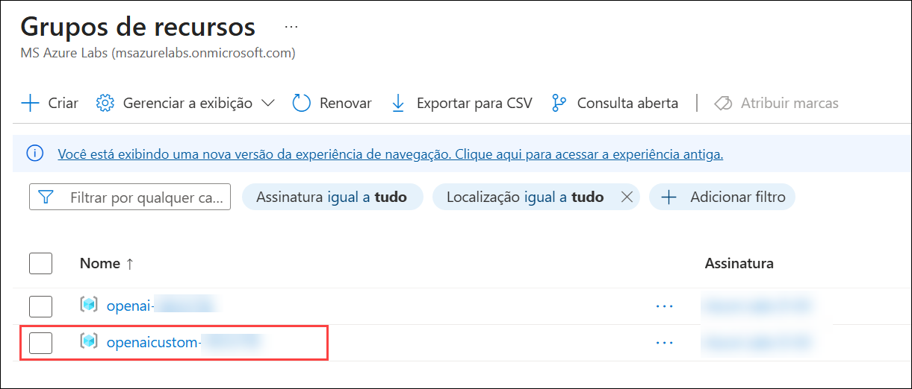

# Exercise 3: Build an Open AI application with Python

### Duração estimada: 90 Minutos

Neste laboratório, os participantes desenvolverão uma aplicação utilizando as APIs da OpenAI e a linguagem de programação Python. O objetivo é demonstrar como implementar funcionalidades de IA, como geração de linguagem, análise de sentimentos ou sistemas de recomendação, utilizando Python, aproveitando os poderosos modelos e ferramentas da OpenAI.

1. Retorne ao **Portal do Azure**. Pesquise **Azure Synapse Analytics (1)** e selecione **Azure Synapse Analytics (2)** no portal do Azure.

      

1. Na janela **Azure Synapse Analytics** selecione **synapseworkspace<inject key="DeploymentID" enableCopy="false"/>**.   

   

1. Na lâmina **Visão geral (1)** na seção **Introdução**, clique em **Abrir (2)** para abrir o Synapse Studio.
     
      
    
1. Clique em **Desenvolver (1)**, depois clique em **+ (2)** e selecione **Importar (3)**.

    

1. Navegue até o `C:\labfile\OpenAIWorkshop-main\scenarios\powerapp_and_python\python` local e selecione `OpenAI_notebook.ipynb` e clique em **Abrir**.

     

1. Clique no ícone **Recolher** para maximizar a tela.

     

1. Selecione **openaisparkpool** no menu suspenso de **Anexar a**.

    

1. Clique no botão **▷ Run** ao lado de cada célula, passo a passo, na ordem mencionada abaixo.

1. Em **1. Install OpenAI**, clique no botão **Run** ao lado da primeira célula.

   

   > **Nota:** Se a célula **Install OpenAI** demorar mais do que o esperado e continuar em execução, clique em **Stop session**. Aguarde até que os **Apache Spark pools** mudem para o estado **Stopped**. Pode ser necessário reiniciar o kernel para utilizar os pacotes atualizados.

      

1. Em **2. Import helper libraries and instantiate credentials**, substitua **AZURE_OPENAI_API_KEY** e **AZURE_OPENAI_ENDPOINT** pela sua chave de API e URL do endpoint. Em seguida, execute esta célula após atualizar os valores necessários.

     
   
1. No Portal do Azure, navegue até o grupo de recursos **openaicustom-<inject key="DeploymentID" enableCopy="false"/>** e selecione o recurso **openai-<inject key="DeploymentID" enableCopy="false"/>** do Azure OpenAI.  

   

   

1. Em **Gerenciamento de Recursos**, selecione **Chaves e Ponto Final (1)** na seção Gerenciamento de Recursos e clique em **Mostrar Chaves (2)**. Copie a **Chave 1 (3)** e o **Ponto de Extremidade (4)** e substitua a **AZURE_OPENAI_API_KEY** e a **AZURE_OPENAI_ENDPOINT** pela chave da API e pela URL do Ponto Final no script.

   

     > **Nota:** Se você encontrar o erro "Módulo OpenAI não encontrado", siga estas etapas:

      - Adicione * ao lado de 0.* para iniciar a instalação do módulo OpenAI mais recente.

      - Execute a célula "Instalar OpenAI". Após a conclusão da instalação, execute o notebook novamente.

           

1. Em **2. Choose a Model**, substitua o valor de **model** de **text-curie-001** para **demomodel** e **execute** esta célula.

    

1. Na célula em **temperature**, substitua o valor de **engine** de **text-curie-001** para **demomodel** e execute esta célula.

     

1. Na célula em **top_p**, substitua o valor de **engine** de **text-curie-001** para **demomodel** e execute esta célula.

     

1. Na célula em **n**, substitua o valor de **engine** de **text-curie-001** para **demomodel** e execute esta célula.

   

1. Na célula em **logprobs**, substitua o valor de **engine** de **text-curie-001** para **demomodel** e execute esta célula.

    

1. Após executar todas as células do Notebook com sucesso, clique em **Publicar tudo**.

     

1. Em seguida, clique em **Publicar** para salvar as alterações.

    

> **Parabéns** pela conclusão da tarefa! Agora é hora de validá-la. Aqui estão os passos:
> - Se receber uma mensagem de sucesso, você pode prosseguir para a próxima tarefa.
> - Caso contrário, leia atentamente a mensagem de erro e repita o passo, seguindo as instruções do guia do laboratório.
> - Se precisar de ajuda, entre em contato conosco pelo e-mail Cloudlabs-support@spektrasystems.com. Estamos disponíveis 24 horas por dia, 7 dias por semana, para ajudar.

<validation step="f943c5b3-b07a-4779-bc2f-9e13ee01378a" />

## Resumo

Neste laboratório, você desenvolveu com sucesso uma aplicação implementando funcionalidades de IA, como geração de linguagem, análise de sentimentos ou sistemas de recomendação usando Python, aproveitando os poderosos modelos e ferramentas do OpenAI.

### Você concluiu o laboratório com sucesso. Clique em **Próximo >>** para prosseguir com o próximo exercício.
 
