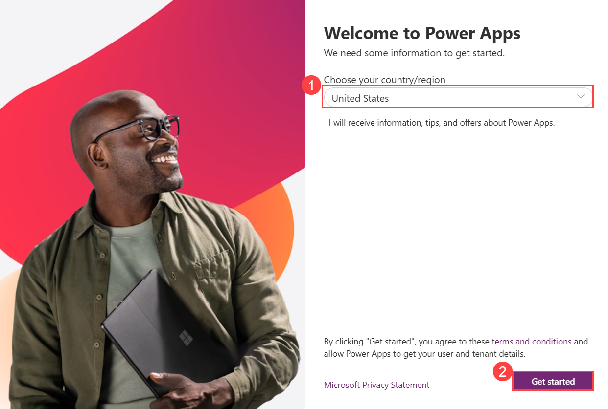
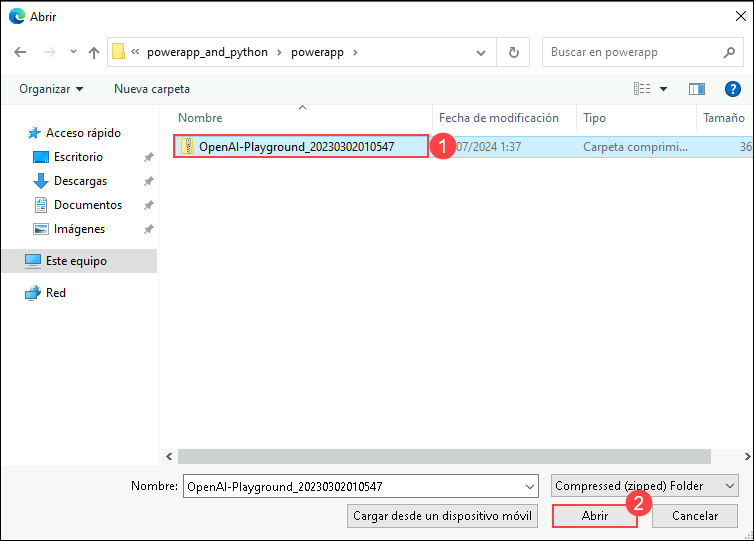
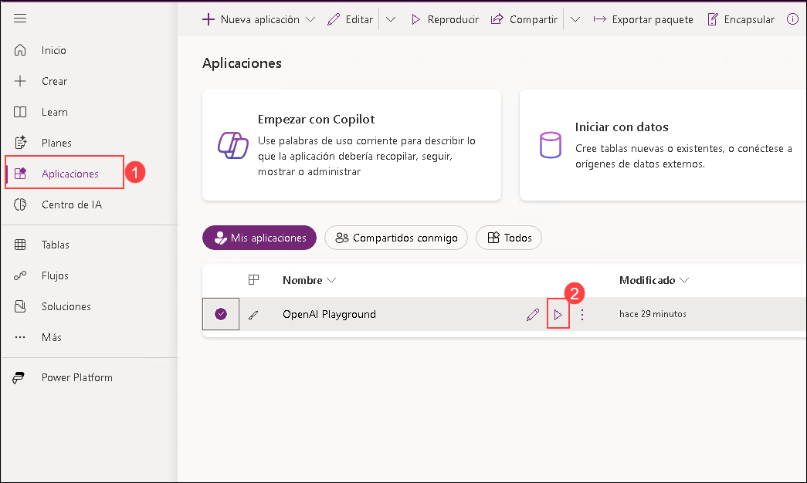

# Exercício 2: Crie uma aplicação Open AI com Power Apps

1. Navegue até https://make.powerapps.com/. Em **Welcome to Power Apps**, selecione o seu **Country/Region (1)** e clique em **Get Started (2)**. 

   
     
2. Selecione **aplicações** na navegação à esquerda e clique em **Importar aplicações de tela**. 

    

3. Na página **Pacote de importação**, clique em **Carregar**.

    

4. Navegue até `C:\labfile\OpenAIWorkshop-main\OpenAIWorkshop-main\scenarios\powerapp_and_python\powerapp` Selecione a pasta  **OpenAI-Playground_20230302010547.zip (1)** e clique em **Open (2)**.

     

5. Uma vez que o arquivo zip é carregado, no **Review Package Content** para **OpenAI Playground**, clique no ícone de configuração em **ACTION**.

     

6. No painel **Import setup**, selecione **Create as new (1)** na lista suspensa para **Setup** e clique em **Save (2)**.

      

7. Repita os passos 5 e 6 para **Openaisummarization**.

8. Em seguida, clique em **Import** para importar o pacote para o ambiente PowerApps.

   

9. Quando a importação estiver concluída, clique em **Aplicações (1)**, clique em `...` **(2)** ao lado de **OpenAI Playground**, e clique em **Editar (3)**.

      

   >**Nota**: Se você não conseguir ver a opção **OpenAI Playground**, aguarde 5 minutos e, enquanto isso, tente atualizar a página.

10. Você observará que ele importou o aplicativo de tela do Power Apps e o Power Automate Flow para o espaço de trabalho.

      

11. Para voltar atrás, clique em **Anterior (1)**, depois clique em **Sair (2)**.

      

12. Em seguida, no tabulador **Fluxos (1)**, selecione **Openaisummarization (2)**, depois clique em `...` **(3)** e **Ligar (4)** seu flow.

      

13. Clique em **Editar** para Openaisummarization.

      

14. Edite o passo HTTP do Power Automate Flow atualizando **https://your-resource-name.openai.azure.com/** com **<inject key="OpenAIEndpoint" enableCopy="true"/>** **(1)**, **deployment-id** com **<inject key="openaimodulename" enableCopy="true"/>** **(2)**, **api-version** com **2023-09-15-preview** **(3)**, **YOUR_API_KEY** com **<inject key="OpenAIKey" enableCopy="true"/>** **(4)**, e clique em **Save** **(5)**.

      
   
15. Na página **Aplicações (1)**, selecione a applicação **OpenAI Playground** para executar o aplicativo clicando no botão **Jogar (2)**.

     

16. Se você receber um pop-up solicitando para iniciar uma avaliação gratuita, clique em **Star a Free Trial**, em seguida, em **You need a Power Apps License to use this app** selecione **Start a 30- teste diário**. Escolha sua região no menu e clique no botão **Começar** aguarde 2-3 minutos. Você pode atrasar o início da versão experimental.
    
17. No **Canvas**, clique no botão **Summary** **(1)** e verifique o **auto-filled text** **(2)**. Em seguida, clique no botão **Submit** **(3)** para obter o **Summary** **(4)**.

     

    > **Nota**: Você pode tentar as outras opções disponíveis no portal, ou seja, **SQL**, **ClassifyText**, **Parse**, e **Classify**.
