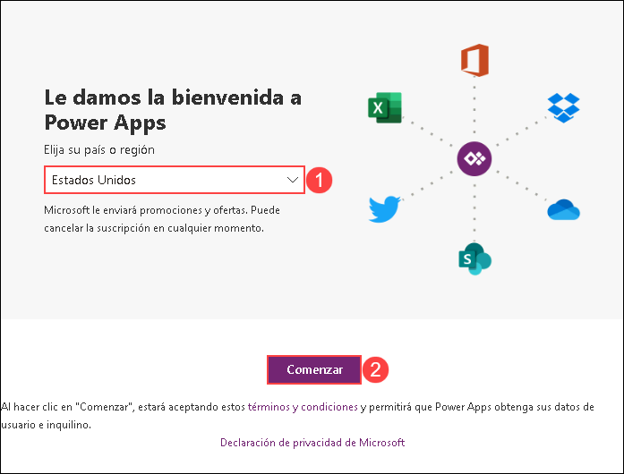

# Exercise 2: Build an Open AI application with Power App 

### Estimated Duration: 60 minutes

This lab focuses on creating an application using OpenAI capabilities integrated with Microsoft Power Apps. Participants will learn how to build a functional application that leverages AI for tasks such as natural language understanding, data analysis, or customer interaction within the Power Apps framework.

1. Open a new tab, and navigate to https://make.powerapps.com/. On **Welcome to Power Apps**, select your **Country/Region (1)** and click **Get Started (2)**. 

   
    
1. Select **Apps** on the left navigation, click on **Import app** dropdown and select **From package (.zip)**. 

    

1. On the **Import package** page, click on **Upload**.

    

1. Navigate to `C:\labfile\OpenAIWorkshop-main\scenarios\powerapp_and_python\powerapp` Select the **OpenAI-Playground_20230302010547.zip (1)** folder and click on **Open (2)**.

     

1. Once the zip file is uploaded, in the **Review Package Content** for **OpenAI Playground**, click on the setup icon under **Actions**.

     

1. In the **Import setup** pane, select **Create as new (1)** from the drop-down for **Setup** and click on **Save (2)**.

      

1. Repeat Steps 5 and 6 for **Openaisummarization**.

1. Next, click on **Import** to import the package into the PowerApps environment.

   

1. Once the import is completed,click on **Apps (1)**, then click on `⋮` **(2)** next to **OpenAI Playground**, and click on **Edit (3)**.

      

   >**Note**: If you're unable to see the **OpenAI Playground** option, please wait for 5 minutes, and in the meantime, try refreshing the page.

1. You will observe that it has imported the Power App canvas app and the Power Automate Flow into the workspace.

      

1. To navigate back, click on **Back (1)**, then click **Leave (2)**.

      

1. In the Azure portal, in the **Search resources, services, and docs** box (1), type **openAI**, and then under **Services**, select **Azure OpenAI** (2).

      

1. Under **Azure OpenAI**, select your Azure OpenAI resource

      

1. Select **Go to Azure AI Foundry portal**.

      

1. Under **Shared resources** (1), select **Deployments** (2), and then choose the **demomodel** deployment (3).

      

1. Copy the **Target URI** endpoint for the deployment, and save it in a Notepad file for later use.

      

1. Next, on the **Flows (1)** tab, select **Openaisummarization (2)**, then click on `...` **(3)** and **Turn on (4)** your flow.

      

1. Click on **Edit** for Openaisummarization.

      

1. Select the **HTTP** action to expand its details.

      

1. Paste the **URI** value (1) you copied earlier, enter your deployment **api-key** (2), replace **YOUR_API_KEY** with **<inject key="OpenAIKey" enableCopy="true"/>**, in the **Body** section (3), paste the code snippet provided below and then select **Save**.

      

      ```json
      {
     "messages": [
       {
         "role": "user",
         "content": "@{triggerBody()?['Initializevariable_Value']}"
       }
     ],
     "max_tokens": 1000,
     "temperature": 1
      }
      ```

      

1. Select the **Parse JSON** action to expand it.

     

1. In the **Schema** section, paste the schema provided below.

      ```json
      {
      "type": "object",
      "properties": {
      "id": {
            "type": "string"
      },
      "object": {
            "type": "string"
      },
      "created": {
            "type": "integer"
      },
      "model": {
            "type": "string"
      },
      "choices": {
            "type": "array",
            "items": {
            "type": "object",
            "properties": {
            "index": {
                  "type": "integer"
            },
            "message": {
                  "type": "object",
                  "properties": {
                  "role": {
                  "type": "string"
                  },
                  "content": {
                  "type": "string"
                  }
                  }
            },
            "finish_reason": {
                  "type": "string"
            }
            },
            "required": [
            "index",
            "message",
            "finish_reason"
            ]
            }
      },
      "usage": {
            "type": "object",
            "properties": {
            "prompt_tokens": {
            "type": "integer"
            },
            "completion_tokens": {
            "type": "integer"
            },
            "total_tokens": {
            "type": "integer"
            }
            }
      }
      }
      }
      ```

     

1. Select the **Parse JSON 2** action to expand it.

     

1. In the **Schema** section, paste the schema provided below.

      ```json
      {
      "type": "object",
      "properties": {
      "index": {
            "type": "integer"
      },
      "message": {
            "type": "object",
            "properties": {
            "role": {
            "type": "string"
            },
            "content": {
            "type": "string"
            }
            }
      },
      "finish_reason": {
            "type": "string"
      }
      }
      }
      ```

     

1. Select the **Respond to a PowerApp or flow** action to expand it.

     

1. In the **Respond to a PowerApp or flow** action, set the output value to **content** from the **Parse JSON 2** action.

     

1. Select **Save** to update the flow.

     

1. From the **Apps (1)** page, click on the **OpenAI Playground** app to run the app by clicking on the **Play (2)** button.

     

1. If you get a popup asking to start a free trial, click on **Star a Free Trial**, then on **You need a Power Apps license to use this app** window select **Start a 30-day trial**. choose your region from the drop-down menu and click on the **Start my trail** button wait for 2-3 minutes It might take to start the trial.
    
1. In the **Canvas**, click on **Summary** **(1)** button and verify the **auto-filled text** **(2)**. Then click on the **Submit** **(3)** button to get the desired **Summary** **(4)**.

     

    > **Note**: You can try the other available options in the portal, i.e., **SQL**, **ClassifyText**, **Parse**, and **Classify**.


## Summary

In this lab, you have successfully integrated OpenAI APIs within Power Apps to enable functionalities like natural language processing, sentiment analysis, or personalized recommendations and built an application.

### You have successfully completed the lab
