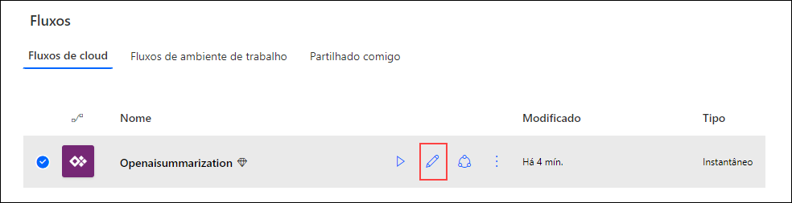

# Exercício 2: Crie uma aplicação Open AI com Power Apps

### Duração estimada: 90 Minutos

Este laboratório se concentra na criação de um aplicativo utilizando os recursos do OpenAI integrados ao Microsoft Power Apps. Os participantes aprenderão a construir um aplicativo funcional que utiliza IA para tarefas como compreensão de linguagem natural, análise de dados ou interação com o cliente dentro da estrutura do Power Apps.

1. Abra uma nova aba e acesse https://make.powerapps.com/. Em **Bem-vindo ao Power Apps**, selecione seu **País/Região (1)** e clique em **Começar (2)**. 

   
     
2. Selecione **Aplicações (1)** na navegação à esquerda, clique no menu suspenso **Importar Aplicaçõao (2)** e selecione **A partir do pacote (.zip) (3)**.

    

3. Na página **Importar pacote**, clique em **Carregar**.

    

4. Navegue até `C:\labfile\OpenAIWorkshop-main\scenarios\powerapp_and_python\powerapp` Selecione a pasta **OpenAI-Playground_20230302010547.zip (1)** e clique em **Abrir (2)**.

    

5. Depois que o arquivo zip for carregado, em **Revisar conteúdo do pacote** para **OpenAI Playground**, clique no ícone de configuração em **Ação**.

     

6. No painel **Importar Configuração **, selecione **Criar como novo (1)** no menu suspenso de **Configuração** e clique em **Guardar (2)**.

      

7. Repita as etapas 5 e 6 para **Openaisummarization**.

8. Em seguida, clique em **Importar** para importar o pacote para o ambiente PowerApps.

     

9. Quando a importação estiver concluída, clique em **Aplicações (1)**, clique em `⋮` **(2)** ao lado de **OpenAI Playground**, e clique em **Editar (3)**.

      

   >**Nota**: Se você não conseguir ver a opção **OpenAI Playground**, aguarde 5 minutos e, enquanto isso, tente atualizar a página.

10. Você observará que ele importou o aplicativo de tela do Power Apps e o Power Automate Flow para o espaço de trabalho.

      

      >**Nota:** se você vir **Bem-vindo ao Power Apps Studio**, clique no botão **Ignorar**.   

11. Para voltar atrás, clique em **Anterior (1)**, depois clique em **Sair (2)**.

      

12. Em seguida, no tabulador **Fluxos (1)**, selecione **Openaisummarization (2)**, depois clique em `...` **(3)** e **Ligar (4)** seu flow.

      

      >**Nota:** se você vir **Bem-vindo ao Power Automate**, clique no botão **Começar**.

13. Clique em **Editar** para Openaisummarization.

      

14. Na etapa HTTP do fluxo, atualize o seguinte:

      - Substitua `https://your-resource-name.openai.azure.com/` with **<inject key="OpenAIEndpoint" enableCopy="true"/> (1)**
      - Substitua `deployment-id` por **<inject key="openaimodulename" enableCopy="true"/> (2)**
      - Substitua `api-version` por **2023-09-15-preview (3)**
      - Substitua `YOUR_API_KEY` por **<inject key="OpenAIKey" enableCopy="true"/> (4)** Em seguida, clique em **Salvar (5)**.
        
         
   
15. Na página **Aplicações (1)**, selecione a applicação **OpenAI Playground** para executar o aplicativo clicando no botão **Jogar (2)**.

     

16. Se você receber um pop-up solicitando o início de um teste gratuito, clique em **Iniciar um teste gratuito**.

      

17. Em seguida, na janela **você precisa de uma licença do Power Apps para usar este aplicativo**, selecione **Iniciar um teste de 30 dias**.

      

18. Selecione sua **região (1)** no menu suspenso e clique no botão **Iniciar minha avaliação (2)**. Aguarde de 2 a 3 minutos, pois o teste pode demorar para iniciar.

      
    
19. No **Canvas**, clique no botão **Summary** **(1)** e verifique o **auto-filled text** **(2)**. Em seguida, clique no botão **Submit** **(3)** para obter o **Summary** **(4)**.

     

    > **Nota**: Você pode tentar as outras opções disponíveis no portal, ou seja, **SQL**, **ClassifyText**, **Parse**, e **Classify**.

## Resumo

Neste laboratório, você integrou com sucesso as APIs OpenAI ao Power Apps para habilitar funcionalidades como processamento de linguagem natural, análise de sentimentos ou recomendações personalizadas, além de criar um aplicativo.

### Você concluiu o laboratório com sucesso. Clique em Próximo >> para prosseguir com o próximo exercício.
 
