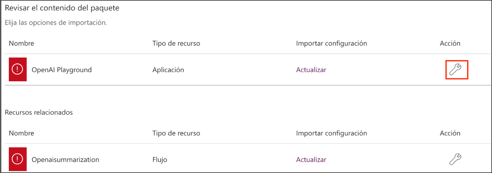

# Ejercicio 2: Crear una aplicación de OpenAI con Power App

### Duración estimada: 90 minutos

Este ejercicio se centra en la creación de una aplicación utilizando las funcionalidades de OpenAI integradas con Microsoft Power Apps. Los participantes aprenderán a crear una aplicación funcional que aprovecha la IA para tareas como la comprensión del lenguaje natural, el análisis de datos o la interacción con el cliente dentro del marco de Power Apps.

1. Abra una nueva pestaña y navegue a [Power Apps](https://make.powerapps.com/). En la página **Bienvenido a Power Apps**, seleccione su **País/Región (1)** y haga clic en **Comenzar (2)**. 

   
    
2. Seleccione **Aplicaciones (1)** en el panel de navegación izquierda, haga clic en el menú desplegable **Importar aplicación (2)** y seleccione **Desde paquete (.zip) (3)**. 

    

3. En la página **Importar paquete**, haga clic en **Cargar**

    

4. Navegue a `C:\labfile\OpenAIWorkshop-main\scenarios\powerapp_and_python\powerapp`. Seleccione la carpeta **OpenAI-Playground_20230302010547.zip (1)** y haga clic en **Abrir (2)**.

     

5. Una vez cargado el archivo zip, en **Revisar el contenido del Paquete** para **OpenAI Playground**, haga clic en el icono de configuración debajo de **Acción**.

     

6. En el panel **Importar configuración**, seleccione **Crear como nueva (1)** del menú desplegable de **Configuración** y haga clic en **Guardar (2)**.

      

7. Repita los Pasos 5 y 6 para el componente **Openaisummarization**.

8. A continuación, haga clic en **Importar** para importar el paquete al entorno de PowerApps.

   

9. Una vez que se complete la importación, vaya a **Aplicaciones (1)**, luego haga clic en el ícono `⋮` **(2)** junto a **OpenAI Playground** y seleccione **Editar (3)**.

      

   >**Nota**: Si no puede ver la opción **OpenAI Playground**, por favor espere 5 minutos y, mientras tanto, intente actualizar la página.

10. Observará que se han importado la aplicación de lienzo Power App y Power Automate Flow al espacio de trabajo.

      

    > **Nota:** Si aparece el mensaje **Bienvenido a Power Apps Studio**, haga clic en **Omitir**.

11. Para navegar hacia atrás, haga clic en **Atrás (1)**, luego haga clic en **Salir (2)**.

      

12. En la pestaña **Flujos (1)**, seleccione el botón de opción junto a **Openaisummarization (2)**, luego haga clic en `...` **(3)** y seleccione **Activar (4)**.

      

      >**Nota:** Si aparece el mensaje **Bienvenido a Power Automate**, haga clic en **Comenzar**.

13. Haga clic en **Editar** para el flujo **Openaisummarization**.

      

14. En el paso HTTP del flujo, actualice lo siguiente:

    - Reemplace `https://your-resource-name.openai.azure.com/` con **<inject key="OpenAIEndpoint" enableCopy="true"/> (1)**.
    - Reemplace `deployment-id` con **<inject key="openaimodulename" enableCopy="true"/> (2)**
    - Reemplace `api-version` con **2023-09-15-preview (3)**
    - Reemplace `YOUR_API_KEY` con **<inject key="OpenAIKey" enableCopy="true"/> (4)**
      Luego, haga clic en **Guardar**.    

      
   
15. En la página **Aplicaciones (1)**, seleccione el botón de opción junto a la aplicación **OpenAI Playground** y haga clic en el botón **Play (2)** para ejecutarla.

     

16. Si se le solicita que inicie una prueba, haga clic en **Iniciar una prueba gratuita**. En la ventana **Necesita una licencia de Power Apps para usar esta aplicación**, seleccione su región, haga clic en **Iniciar mi prueba** y espere de 2 a 3 minutos.
    
17. En la aplicación canvas, haga clic en el botón **Summary** **(1)** y verifique el **texto inicial** **(2)**. Luego haga clic en el botón **Submit** **(3)** para obtener el **Resumen** **(4)** deseado.

     

    > **Nota**: También puede explorar las otras opciones disponibles como **SQL**, **ClassifyText**, **Parse**, y **Classify**.

## Resumen

En este ejercicio, ha integrado correctamente las APIs de OpenAI con Power Apps para habilitar funcionalidades como el procesamiento del lenguaje, el resumen y la automatización inteligente mediante un flujo de Power App y Power Automate.

### Ha completado el ejercicio correctamente. Haga clic en **Siguiente >>** para continuar con el siguiente ejercicio.

