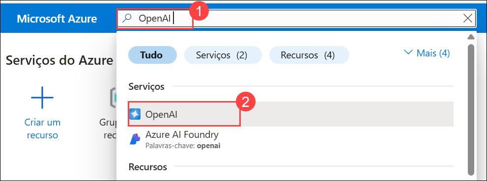
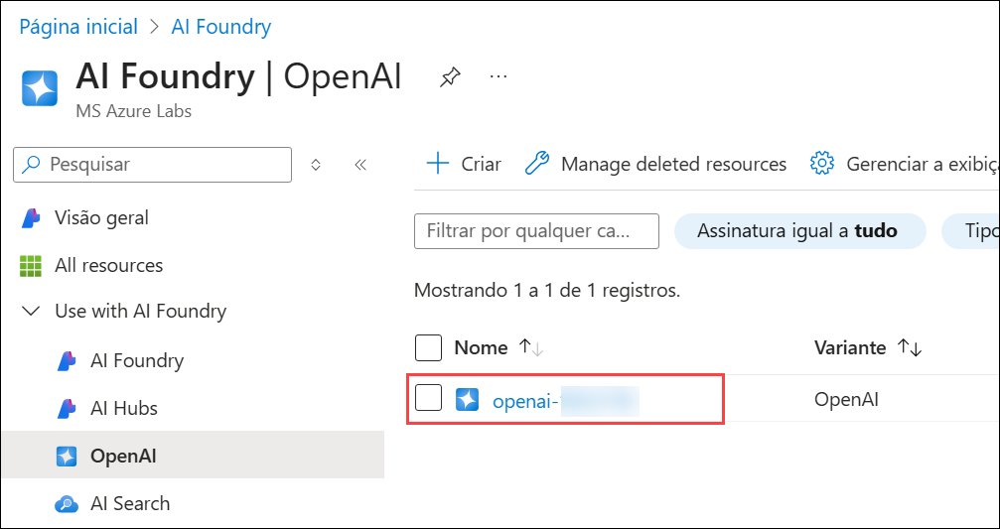
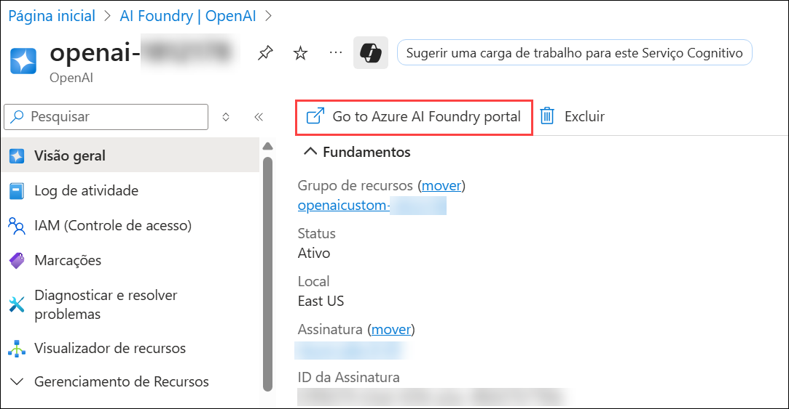
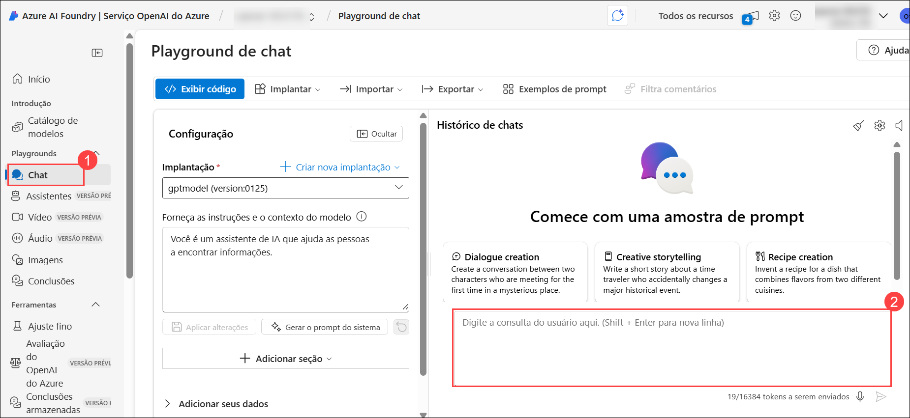

# Exercício 4a: Introdução à Engenharia de Prompt e ao portal Azure AI Foundry

### Duração estimada: 90 Minutos

Neste exercício, você explorará o conceito de engenharia de prompt, aprendendo a elaborar prompts eficazes para modelos de IA. Você terá experiência prática com o Playground do Azure OpenAI, experimentando diferentes tipos de prompts e compreendendo seus elementos e dicas de design.

## Tópicos

- [O que é um Prompt?](#what-is-a-prompt)
- [O que é Engenharia de Prompt?](#what-is-prompt-engineering)
- [Experimentando a Engenharia de Prompt com o Playground do Azure OpenAI ](#Trying-out-Prompt-Engineering-with-Azure-OpenAI-Playground)
- [Exemplos de Prompts básicos](#basic-prompt-examples)
- [Elementos de um Prompt](#elements-of-a-prompt)
- [Parâmetros do playground de Chat](#Chat-playground-parameters)
- [Dicas gerais para a Criação de Prompts](#general-tips-for-designing-prompts)


## O que é um Prompt?


Todos nós já vimos o cursor piscando, esperando que ajamos, indicando nossa chance de fornecer uma entrada...

Uma maneira de pensar em um prompt é como um trecho de texto usado para iniciar ou fornecer contexto para a geração de uma saída (em nossos casos de uso, primariamente linguagem natural) pelo modelo de linguagem. Isso pode ser uma frase de entrada, pergunta ou tópico para gerar uma resposta do modelo de linguagem.

## O que é Engenharia de Prompt?
A Engenharia de Prompt é uma [disciplina](https://www.businessinsider.com/prompt-engineering-ai-chatgpt-jobs-explained-2023-3) relativamente nova para desenvolver e otimizar prompts para usar eficientemente modelos de linguagem (LMs) em uma ampla variedade de aplicativos de negócios. As habilidades de engenharia de prompt ajudam a entender melhor as capacidades e limitações dos grandes modelos de linguagem (LLMs) e a refinar as conclusões (saídas) dos LLMs. A engenharia de prompt é usada para melhorar a capacidade dos LLMs em uma vasta gama de tarefas comuns e complexas, como responder a perguntas e raciocínio aritmético. Os desenvolvedores usam a engenharia de prompt para projetar técnicas de prompting robustas e eficazes que interagem com LLMs e outras ferramentas.

Este guia cobre o básico dos prompts padrão para fornecer uma ideia geral de como interagir e instruir os LLMs encontrados no [Playground do portal Azure AI Foundry](https://oai.azure.com/portal/playground).

###  Experimentando a Engenharia de Prompt com o Playground do Azure OpenAI
O portal Azure AI Foundry fornece acesso à gestão de modelos, implantação, experimentação, customização e recursos de aprendizagem. O playground de Chat dentro do portal Azure AI Foundry é baseado em uma interface de entrada de conversação e saída de mensagem. Você pode inicializar a sessão com uma mensagem de sistema para configurar o contexto do chat.

No playground de Chat, você pode adicionar exemplos *few-shot*. O termo *few-shot* refere-se ao fornecimento de alguns exemplos para ajudar o modelo a aprender o que precisa fazer. Você pode pensar nisso em contraste com *zero-shot*, que se refere a não fornecer nenhum exemplo.

Na configuração do Assistente, você pode fornecer exemplos *few-shot* de qual pode ser a entrada do usuário e qual deve ser a resposta do assistente. O assistente tenta imitar as respostas que você inclui aqui no tom, regras e formato que você definiu em sua mensagem de sistema.

Vamos em frente e iniciar o playground do Azure AI Foundry para aprender sobre engenharia de prompt.

1. No **Portal de Azure**, pesquise por **OpenAI do Azure** e selecione **OpenAI do Azure**.

   

1. Na janela **AI Foundry | OpenAI**, selecione **openai-<inject key="DeploymentID" enableCopy="false"/>**

    

1. No painel de recursos do OpenAI do Azure, clique em **Go to Azure AI Foundry portal** o que o levará para o **portal do Azure AI Foundry**.

   

1. No **Azure AI Foundry | Serviço OpenAI do Azure**, clique em **Chat** em **Playgrounds** no menu à esquerda.

    .png)

1. Na seção **Chat (1)**, faça qualquer consulta na **sessão de chat** **(2)** para obter a resposta do OpenAi.
 
    

---
## Exemplos de Prompts básicos

> **Observação:** Sinta-se à vontade para inserir qualquer coisa listada na caixa `Prompt:` em um modelo `gpt-35-turbo-instruct` no [Playground do portal Azure AI Foundry](https://oai.azure.com/portal/playground) para acompanhar estes exemplos de prompt. Esteja ciente de que você pode receber saídas diferentes das listadas na caixa `Saída:`, dada a natureza dos modelos generativos. 

Você pode alcançar muito com prompts, mas a qualidade dos resultados depende da quantidade de informação que você fornece no prompt sem ser excessivamente descritivo. Um prompt pode conter informações como instruções ou perguntas. Como aprenderemos mais tarde com prompts mais avançados, também podemos fornecer exemplos de saídas desejadas, bem como contexto para nossas instruções.

Aqui está um exemplo básico de um prompt simples:

*Prompt:*
```
O que é GPT-3?
```
*Saída:*
```
 Um modelo de linguagem autorregressivo desenvolvido pela OpenAI. A sigla significa Generative Pre-trained Transformer 3 (Transformador Generativo Pré-treinado 3). Trata-se de um modelo de linguagem em larga escala que utiliza técnicas de aprendizado profundo (deep learning) para gerar textos com características semelhantes aos produzidos por humanos. O GPT-3 utiliza uma arquitetura baseada em transformers para gerar textos com contexto.
```
> **Observação:**  A `Saída` em nosso exemplo termina abruptamente porque nossa variável **Max length (tokens)** está definida como `=60`. **Max Length (tokens)** define um limite para o número de tokens a serem gerados em uma resposta. O modelo `gpt-35-turbo-instruct` suporta um máximo de 4000 tokens compartilhados entre um determinado prompt e a conclusão da resposta. (Um token tem aproximadamente 4 caracteres para o texto típico em inglês.)

A `Saída:` é uma série de strings que fazem sentido dado o contexto fornecido pelo nosso prompt de `"O que é GPT3-3?"`. No entanto, a saída pode ser indesejada ou inesperada com base no nosso caso de uso. Como podemos refinar, ou projetar, nosso prompt para alcançar o resultado desejado?

A primeira coisa que podemos fazer é fornecer instruções explícitas sobre o que queremos que o modelo faça com nosso prompt anterior. É o que se entende por _engenharia de prompt_: refinar a entrada para produzir a melhor saída do LLM.

*Prompt:*
```
Conte-me uma piada que comece com: GPT-3 é
```

*Saída:*
```
O GPT-3 é tão inteligente que consegue contar uma piada sem ter um desfecho.
```

Nossas instruções melhoraram nossa saída? É verdade que esta não é a piada mais engraçada já contada. E, ao contrário de problemas de aprendizado supervisionado, não há uma métrica de erro ou perda fácil para comparar as duas saídas. Vejamos exatamente o que pedimos ao modelo para gerar e o que recebemos:

| Requisito | A Saída atende ao requisitos? | 
|-------------|--------|
| Comece com as palavras, "GPT-3 é" | Sim, o `Saída:` começou com as palavras "GPT-3 é" |
| A saída está na forma de uma piada | Foi feita uma tentativa |

---
## Prompts padrão

Analisamos dois prompts muito básicos acima, bem como a saída que eles geraram. Agora que estamos familiarizados com os conceitos básicos de engenharia de prompt, vamos ver alguns formatos comuns para prompts.

### Formato da Pergunta

```
<Pergunta>?
```
### Formato Pergunta-Resposta
Isso pode ser formatado em um formato de QA (Question-Answer), que é padrão em muitos conjuntos de dados de QA, da seguinte forma:

```
Q: <Pergunta>?
A: 
```
Outra maneira de pensar sobre isso, usando outros termos comuns, seria:
```
Prompt: <Pergunta>?
Completion: <Resposta>
```
### Formato Few-shot
Dado o formato padrão acima, uma técnica popular e eficaz de prompting é chamada de few-shot prompting, onde fornecemos múltiplos exemplos. Prompts few-shot podem ser formatados da seguinte forma:

```
<Pergunta>?
<Resposta>

<Pergunta>?
<Resposta>

<Pergunta>?
<Resposta>

<Pergunta>?

```

### Formato de Pergunta-Resposta (QA) Few-shot
E você já pode adivinhar que sua versão em formato QA ficaria assim:

```
Q: <Pergunta>?
A: <Resposta>

Q: <Pergunta>?
A: <Resposta>

Q: <Pergunta>?
A: <Resposta>

Q: <Pergunta>?
A:
```

Tenha em mente que não é necessário usar o formato QA. O formato depende da tarefa em questão. Por exemplo, você pode realizar uma tarefa de classificação simples e dar exemplos que demonstram a tarefa da seguinte forma:

*Prompt:*
```
Isso é incrível! // Positivo
Isso é ruim! // Negativo
Uau, aquele filme foi demais! // Positivo
Que programa horrível! // Negativo
```

*Saída:*
```
Negativa
```
ou
*Prompt:*
```
A seguir está uma lista de empresas e as categorias às quais elas pertencem:

Facebook: Mídia social, Tecnologia
LinkedIn: Mídia social, Tecnologia, Corporativo, Carreiras
Uber: Transporte, Tecnologia, Marketplace
Unilever: Conglomerado, Bens de consumo
McDonald’s: Alimentação, Fast food, Logística, Restaurantes
FedEx:
```
*Saída:*
```
Logística, Entrega e Envio
```
Prompts few-shot permitem a aprendizagem em contexto (in-context learning), que é a capacidade dos modelos de linguagem de aprender tarefas recebendo apenas alguns exemplos. Veremos mais disso em ação nas próximas seções de engenharia de prompt avançada.

---

## Elementos de um Prompt

À medida que cobrimos mais e mais exemplos e aplicações que são possíveis com a engenharia de prompt, você notará que existem certos elementos que compõem um prompt.

Um prompt pode conter qualquer um dos seguintes componentes:

- **Instrução:** uma tarefa ou instrução específica que você quer que o modelo execute.

- **Contexto:** pode envolver informações externas ou contexto adicional que pode guiar o modelo para melhores respostas.

- **Dados de Entrada:** é a entrada ou pergunta para a qual estamos interessados em encontrar uma resposta.

- **Indicador de Saída:** Indica o tipo ou formato da saída.

Nem todos os componentes são necessários para um prompt, e o formato depende da tarefa em questão. Abordaremos exemplos mais concretos em nossos próximos guias.

---

## Parâmetros do playground de Chat

Existem muitos parâmetros que você pode ajustar para alterar o desempenho do seu modelo:

- **Parâmetros:** Parâmetros personalizados que alteram as respostas do modelo. Ao começar, recomendamos usar os valores padrão para a maioria deles.
  
- **Mensagens anteriores incluídas:** Selecione o número de mensagens anteriores que serão incluídas em cada nova solicitação à API. Isso ajuda a fornecer contexto ao modelo para novas perguntas do usuário. Por exemplo, definir esse número como 10 fará com que sejam incluídas 5 perguntas do usuário e 5 respostas do sistema.
  
- **Temperatura:** Controla a aleatoriedade. Diminuir a temperatura significa que o modelo produz respostas mais repetitivas e determinísticas. Aumentar a temperatura resulta em respostas mais inesperadas ou criativas. Tente ajustar a temperatura ou o Top P, mas não ambos.

- **Resposta máxima (tokens):** Defina um limite para o número de tokens por resposta do modelo. A API dos modelos mais recentes suporta um máximo de 128.000 tokens compartilhados entre o prompt (incluindo mensagem de sistema, exemplos, histórico de mensagens e consulta do usuário) e a resposta do modelo. Um token tem aproximadamente quatro caracteres para texto típico em inglês.

- **Parar sequência:**  Faça com que as respostas parem em um ponto desejado, como o final de uma frase ou lista. Especifique até quatro sequências em que o modelo deixará de gerar mais tokens em uma resposta. O texto retornado não conterá a stop sequence.

- **Top probabilities (Top P):** imilar à temperatura, controla a aleatoriedade, mas usa um método diferente. Diminuir o Top P restringe a seleção de tokens do modelo para tokens mais prováveis. Aumentar o Top P permite que o modelo escolha entre tokens com alta e baixa probabilidade. Tente ajustar a temperatura ou o Top P, mas não ambos.

- **Penalidade por frequência:** Reduz a chance de repetir um token proporcionalmente com base na frequência com que ele apareceu no texto até agora. Isso diminui a probabilidade de repetir o mesmo texto exato em uma resposta.

- **Penalidade por presença:** Reduz a chance de repetir qualquer token que já tenha aparecido no texto. Isso aumenta a probabilidade de introduzir novos tópicos em uma resposta.

A contagem atual de tokens é visível no playground de Chat. Como as chamadas de API são precificadas por token e é possível definir um limite máximo de tokens de resposta, você deve ficar de olho na contagem atual de tokens para garantir que a conversa de entrada não exceda a contagem máxima de tokens de resposta.

## Dicas gerais para a Criação de Prompts

Aqui estão algumas dicas que você deve ter em mente ao projetar seus prompts:

### Comece de Forma Simples
Ao começar a criar prompts, você deve ter em mente que é um processo iterativo que requer experimentação para obter resultados ideais. Usar um playground como o [Playground do Azure OpenAI Studio](https://oai.azure.com/portal/playground) permitirá que você teste ideias de forma rápida e fácil. O modelo não ficará ofendido se você pedir para ele fazer coisas muito semelhantes repetidamente!

Você pode começar com prompts simples e continuar adicionando mais elementos e contexto à medida que busca resultados melhores. Versionar seu prompt ao longo do caminho é vital por essa razão. Conforme lemos o guia, você verá muitos exemplos onde especificidade, simplicidade e concisão geralmente lhe darão melhores resultados. Comece com um prompt fixo e passe para prompts gerados mais dinamicamente à medida que refina seus resultados.

### A Instrução
Você pode criar prompts eficazes para várias tarefas simples usando comandos para instruir o modelo sobre o que você quer alcançar, como "Escreva", "Classifique", "Resuma", "Traduza", "Ordene", "Crie", "Faça", etc.

Tenha em mente que você também precisa experimentar muito para ver o que funciona melhor. Tente diferentes instruções com diferentes palavras-chave, contexto e dados e veja o que funciona melhor para seu caso de uso e tarefa específicos. Geralmente, quanto mais específico e relevante for o contexto para a tarefa que você está tentando realizar, melhor.

Outros recomendam que as instruções sejam colocadas no início do prompt. Também é recomendado que alguns separadores claros, como "###", sejam usados para separar a instrução e o contexto.

Por exemplo:

*Prompt:*
```
### Instrução ###
Traduza o texto abaixo para o espanhol:

Texto: "Olá!"
```

*Saída:*
```
Texto:¡Hola!
```

### Especificidade
Seja muito específico sobre as instruções e tarefas que você quer que o modelo execute. Quanto mais descritivo e detalhado for o prompt, melhores serão os resultados. Isso é particularmente importante quando você tem um resultado ou estilo de geração desejado. Não existem tokens ou palavras-chave específicas que levem a melhores resultados. É mais importante ter um bom formato e um prompt descritivo. Fornecer exemplos no prompt é muito eficaz para obter a saída desejada em formatos específicos.

Ao criar prompts, você também deve ter em mente o comprimento do prompt, pois existem limitações sobre quão longo ele pode ser. Pensar em quão específico e detalhado você deve ser é algo a se considerar. Muitos detalhes desnecessários não são necessariamente uma boa abordagem. Os detalhes devem ser relevantes e contribuir para a tarefa em questão. Isso é algo que você precisará experimentar muito. Incentivamos muita experimentação e iteração para otimizar prompts para suas aplicações.

Como exemplo, vamos tentar um prompt simples para extrair informações específicas de um trecho de texto.

*Prompt:*
```
Há muitas frutas que foram encontradas no recém-descoberto planeta Goocrux. Lá crescem as neoskizzles, que são roxas e têm sabor de doce. Também existem as heckles, uma fruta de cor azul-acinzentada e sabor bem azedo, um pouco parecida com o limão. As pounits têm uma cor verde vibrante e são mais salgadas do que doces. Há também muitas loop novas, que possuem um sabor rosa neon e lembram algodão-doce. Por fim, existem as frutas chamadas glowls, que têm um gosto muito azedo e amargo, com acidez intensa e efeito cáustico, além de um tom laranja-claro.

Por favor, faça uma tabela resumindo as frutas do planeta Goocrux.
| Fruta | Cor | Sabor |
| Neoskizzles | Roxa | Doce |
| Heckles | Azul acinzentado | Azedo |
```

*Saída:*
```
| Pounits | Verde vibrante | Mais salgado que doce |
| Loopnovas | Rosa neon | Algodão-doce |
| Glowls | Laranja pálido | Muito azedo e amargo (ácido e cáustico |
```
> **Observação:** As instruções são `Por favor, faça uma tabela resumindo as frutas do planeta Goocrux`, e então uma tabela de exemplo com cabeçalhos de coluna e dois exemplos, com os elementos corretos em suas respectivas colunas, são fornecidos, tornando este um prompt few-shot.

### Evite imprecisões

Dadas as dicas acima sobre ser detalhado e melhorar o formato, é fácil cair na armadilha de querer ser muito esperto sobre os prompts e potencialmente criar descrições imprecisas. Muitas vezes é melhor ser específico e direto. O modelo não se importa que você seja explícito em suas instruções; você não pode ofendê-lo! A analogia aqui é muito semelhante à comunicação eficaz: quanto mais direto, mais eficazmente a mensagem é transmitida.

Por exemplo, você pode estar interessado em aprender o conceito de engenharia de prompt. Você pode tentar algo como:
*Prompt:*
```
Forneça uma explicação curta sobre o que é engenharia de prompts em PLN, sem usar linguagem técnica.
```
*Saída:*
```
Engenharia de prompts em NLP é o processo de criar perguntas ou instruções para ajudar o computador a entender a linguagem natural. Isso envolve formular perguntas ou frases que façam o computador gerar uma resposta em linguagem natural.
```
Não está claro no prompt acima quantas frases usar, em que estilo queremos que as coisas sejam produzidas ou o que pretendemos extrair da saída. Você pode obter respostas passáveis com o prompt acima; o prompt melhor seria muito específico, conciso e direto. Algo como:

*Prompt:*
```
Forneça uma lista com cinco tópicos, uma frase cada, descrevendo os benefícios da engenharia de prompts ao interagir com um modelo de linguagem grande, usando um nível de compreensão equivalente ao da 8ª série.
```
*Saída:*
```
• Aumenta a eficiência ao reduzir a necessidade de entrada do usuário.
• Melhora a experiência do usuário ao diminuir o tempo de espera por uma resposta.
• Reduz a carga cognitiva ao simplificar a linguagem e fornecer instruções claras.
• Aumenta a precisão ao oferecer um formato consistente para a entrada de linguagem.
• Melhora a escalabilidade ao permitir a integração de modelos de linguagem mais complexos.
```

### Fazer ou não fazer?

Outra dica comum ao criar prompts é evitar dizer o que não fazer, mas sim dizer o que fazer. Isso incentiva mais especificidade e um foco nos detalhes que levam a boas respostas do modelo.

Aqui está um exemplo de um chatbot de suporte de TI que não consegue seguir nossas instruções porque elas são formuladas negativamente.

*Prompt:*
```
O texto a seguir é uma troca entre um agente de suporte de TI e um cliente. O cliente está bloqueado fora da conta. NÃO PEÇA A SENHA DELE. NÃO PERGUNTE SOBRE INFORMAÇÕES PESSOAIS.

Cliente: Não consigo acessar minha conta.
Agente de Suporte de TI:
```

*Saída:*
```
Ok, Entendo. Você pode, por favor, informar o endereço de e-mail que está tentando usar para fazer login?
```

Aqui está um prompt melhor:

*Prompt:*
```
A seguir está uma conversa entre um agente de suporte de TI e um cliente. O cliente está bloqueado fora da conta. O agente de suporte de TI não deve discutir informações pessoais, como nome de usuário, senha, nome, endereço de e-mail, número da conta, telefone ou perguntas de segurança. Se o agente de suporte precisar de informações pessoais para ajudar o cliente, deve pedir que ele clique no link "Esqueci a senha" na página de login e siga as instruções na tela.

Cliente: Não consigo acessar minha conta.
Agente de Suporte de TI:
```

*Saída:*
```
Peço desculpas pela dificuldade que você está tendo para acessar sua conta. Por favor, clique no link "Esqueci a senha" na página de login e siga as instruções na tela para redefinir sua senha e acessar sua conta.
```

Alguns dos exemplos acima foram adaptados do artigo ["Best practices for prompt engineering with OpenAI API" article](https://help.openai.com/en/articles/6654000-best-practices-for-prompt-engineering-with-openai-api) e do
[Democratizing Artificial Intelligence Research, Education, and Technologies's Prompt Engineering Guide](https://github.com/dair-ai/Prompt-Engineering-Guide)

## Resumo

Neste exercício, você aprendeu a criar prompts poderosos para modelos de IA, examinando a ideia de engenharia de prompt nesta tarefa. Usando o Playground do Azure OpenAI, você ganhou experiência prática ao experimentar vários tipos de prompt e compreender seus componentes e dicas de design.

### Você concluiu o laboratório com sucesso. Clique em **Próximo >>** para prosseguir com o próximo exercício.

